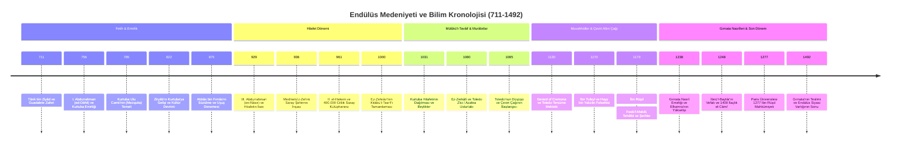

# Zamân-ı Endülüs (zamani-endulus)

> *“Kayıp bir bahçenin izinde; Kurtuba kütüphanelerinden Toledo tercüme mekteplerine, Akdeniz’in zeytinliklerinden Elhamra’nın kemerlerine uzanan bilimsel, felsefi, edebi, mimari ve teknolojik miras külliyatı.”*

---

## 1. Giriş ve Epistemolojik Çerçeve

Endülüs (711–1492), salt yedi buçuk asır sürmüş bir siyasi hakimiyet sahası değil; Antik Mısır, Mezopotamya, Grek ve Hint miraslarının İslam düşünce havzasında meczedilip dönüştürüldüğü, oradan da Latin Batı'ya intikal ettirilerek Rönesans'ın, modern tıbbın ve rasyonalist felsefenin mayalandığı kurucu bir Akdeniz medeniyetidir.

İber Yarımadası’nda neşet eden bu tecrübe; Bağdat ve Şam’dan devraldığı nazari birikimi, Guadalquivir (*Vâdî el-Kebîr*) kıyılarında **ampirik gözlem**, **cerrahi alet morfolojisi**, **hidrolik otomasyon**, **evrensel usturlap tasarımı**, **pedolojik ziraat ıslahı** ve **rasyonalist felsefi metodoloji** ile taçlandırmıştır.

**`zamani-endulus`**, popüler hamasetten ve doğrulanmamış rivayetlerden arındırılmış biçimde; birinci elden yazma eser katalogları, tercüme kronikleri, analitik monografiler, tenkitli metinler ve açık kaynaklı yazılım araçlarıyla Endülüs birikimini eksiksiz bir dijital araştırma kütüphanesine dönüştürmeyi amaçlar.

```
                  ┌────────────────────────────────────────────────────────┐
                  │            ANTİK BİLİM & FELSEFİ MİRAS                 │
                  │       (Grek, Helenistik, Hint, Mezopotamya)            │
                  └──────────────────────────┬─────────────────────────────┘
                                             │
                                             ▼
                  ┌────────────────────────────────────────────────────────┐
                  │             İSLAM DÜŞÜNCE HAVZASI                      │
                  │       (Bağdat Beytülhikme & Şam Rasathaneleri)         │
                  └──────────────────────────┬─────────────────────────────┘
                                             │
                                             ▼
      ┌────────────────────────────────────────────────────────────────────────────────┐
      │                        ZAMÂN-I ENDÜLÜS KÜLLİYATI                               │
      │   Kurtuba • İşbiliye • Tuleytula • Gırnata • Belensiye • Serakusta • Mürsiye   │
      └──────┬──────────────────────┬────────────────────┬──────────────────────┬──────┘
             │                      │                    │                      │
             ▼                      ▼                    ▼                      ▼
      ┌──────────────┐      ┌──────────────┐      ┌──────────────┐      ┌──────────────┐
      │ Tıp & Cerrahi│      │ Astronomi &  │      │ Felsefe &    │      │ Hidroloji &  │
      │  (Zehrâvî,   │      │ Mekanik      │      │ Epistemoloji │      │ Ziraat       │
      │  İbn Zühr,   │      │  (Zerkâle,   │      │  (İbn Rüşd,  │      │ (Acequia,    │
      │ İbnü'l-Baytâr)│     │ Câbir b.Eflah)│     │  İbn Bâcce,  │      │  İbn Bassâl, │
      │              │      │              │      │  İbn Tufeyl) │      │ İbnü'l-Avvâm)│
      └──────┬───────┘      └──────┬───────┘      └──────┬───────┘      └──────┬───────┘
             │                     │                     │                     │
             └─────────────────────┼─────────────────────┴─────────────────────┘
                                   │
                                   ▼
                  ┌────────────────────────────────────────────────────────┐
                  │               TOLEDO TERCÜME MEKTEBİ                   │
                  │   (Gerard of Cremona, Michael Scot, Gundissalinus)     │
                  └──────────────────────────┬─────────────────────────────┘
                                             │
                                             ▼
                  ┌────────────────────────────────────────────────────────┐
                  │        AVRUPA ÜNİVERSİTELERİ & RÖNESANS                │
                  │   (Salerno, Montpellier, Bologna, Paris, Padova)       │
                  └────────────────────────────────────────────────────────┘
```

---

## 2. Disiplinlerarası Külliyat Mimarisi

Bu repo, Endülüs bilim ve düşünce mirasını beş temel ana eksen üzerinde monografik ve analitik olarak belgeler:

### 1. Cerrahi, Klinik Patoloji ve Farmakoloji Ekolü
* **Ebû'l-Kâsım ez-Zehrâvî (Abulcasis, 936–1013):** *Kitâbü't-Tasrîf* 30. cilt (*el-ʿAmel bi'l-Yed*) kapsamında modern cerrahinin temelleri; kedi bağırsağından emilebilir dikiş ipi (*catgut*), koterizasyon teknikleri, litotomi (taş çıkarma), jinekolojik spekulumlar, trakeotomi ve 200'den fazla ameliyat aletinin teknik morfolojisi.
* **Ebû Mervân İbn Zühr (Avenzoar, 1094–1162):** *Kitâbü't-Teysîr fi'l-Müdâvât ve't-Tedbîr* ile spekülatif tıp yerine deneysel patolojinin ikamesi; hayvanlar (keçiler) üzerinde yapılan ameliyat deneyleri, perikardit ve mediastinal apselerin klinik ayrımı, uyuz mikrobunun (*Sarcoptes scabiei*) tespiti.
* **İbnü'l-Baytâr (1197–1248):** *el-Câmiʿ li-Müfredâti'l-Edviye ve'l-Aġẕiye*; Akdeniz havzasından derlenen 1.400'den fazla tıbbi nebatat, mineral ve hayvansal ilacın taksonomisi; Grekçe, Latince, Berberice, Farsça ve Endülüs Romansçası eşanlamlılar sözlüğü.
* **İbn Rüşd (Averroes, 1126–1198):** *Kitâbü'l-Külliyyât fi't-Tıbb* (Colliget); insan vücudunun genel fizyolojisi, hijyen kuralları ve tıbbın teorik ilkeleri.

### 2. Astronomi, Matematik ve Mekanik Enstrümantasyon
* **İbnü'z-Zerkâle (Arzachel, 1029–1087):** Kutup noktalarından bağımsız, dünyanın her enleminde tek bir diskle çalışan evrensel usturlap (*Safîha ez-Zerkâliyye / Azafea*); Güneş evcinin (apogee) yılda 12.04 yay saniyesi hızla hareket ettiğinin kanıtı; *Tuleytula Cetvelleri* (Toledo Tables) ve Toledo mekanik su saatleri.
* **Câbir bin Eflah (Geber, ö. c. 1145):** *Islâhu'l-Mecistî*; Batlamyus geosentrik sisteminin analitik reddi, dik açılı küresel üçgenler için **Geber Teoremi** ($\cos A = \cos a \cdot \sin B$), gezegenlerin Güneş diski önündeki paralaks analizleri.
* **Nûreddin el-Bitrûcî (Alpetragius, ö. c. 1204):** *Kitâb fî'l-Hey'e*; episikl ve eksantrik çemberleri reddeden, gezegenlerin görünürdeki hareketlerini spiral salınımla açıklayan Aristo merkezli homosentrik küreler teorisi.

### 3. Rasyonalizm, Epistemoloji ve Mantık Metodolojisi
* **İbn Rüşd (Averroes):** *Faslü'l-Makâl* (Felsefe ile dinin uzlaşımı, aklî burhânın fıkhî vücûbiyeti), *Tehâfütü't-Tehâfüt* (Gazzâlî'ye karşı sebep-sonuç / illiyet yasasının mutlak savunusu), *Büyük Aristoteles Şerhleri* (Büyük, Orta ve Küçük şerh geleneği).
* **İbn Bâcce (Avempace, 1085–1138):** *Tedbîrü'l-Mütevahhid*; yozlaşmış toplumlarda erdemli bilgenin zihinsel yalnızlaşması (*nevâbit* teorisi), ruhani suretler ve Galileo mekaniğine öncülük eden serbest düşme/direnç fiziği ($v = F - R$).
* **İbn Tufeyl (Abubacer, 1105–1185):** *Risâletü Hayy bin Yakzân*; tabula rasa (boş levha) epistemolojisi, tabiatı ampirik yöntemle disseksiyon ve gözlem yoluyla keşfeden otodidaktik akıl; John Locke ve Spinoza üzerindeki doğrudan tesir.
* **İbn Hazm el-Endelüsî (994–1064):** *Kitâbü'l-Fasl fi'l-Milel ve'l-Ehvâʾ ve'n-Nihal* (Dinler ve mezhepler tarihi metodolojisi), *et-Takrîb li-Haddi'l-Mantık* (Aristo mantığının fıkha uygulanması), *Tavku'l-Hamâme* (Aşk ve insan psikolojisi).

### 4. Hidroloji, Tarım Teknolojileri (Filâha) ve Mimari Statik
* **İbn Bassâl ve İbnü'l-Avvâm:** *Kitâbü'l-Filâha*; toprak türlerinin su tutma kapasitesi ve mineral dengesine göre 10 sınıfa ayrıldığı pedolojik analizler, 585 kültür bitkisi taksonomisi, teraslama ve ağaç aşılama metotları.
* **Hidrolik Mühendisliği:** Guadalquivir ve Turia nehirleri üzerindeki akıntı gücüyle çalışan dev su dolapları (*noria*), dağ akiferlerinden şehirlere su taşıyan yer altı kehrizleri (*qanat*), yerçekimi esaslı ark şebekeleri (*acequia*) ve 10. yüzyıldan beri kesintisiz işleyen **Valensiya Su Mahkemesi** (*Tribunal de las Aguas*).
* **Mimari Akustik ve Statik:** Kurtuba Ulu Camii'nin çift katlı almaşık at nalı kemer sistemi (sismik şok sönümleme dinamiği), Medînetü'z-Zehrâ teraslı sıhhi drenaj ağı, Elhamra ve Cennetü'l-Ârif (*Generalife*) saraylarındaki hidrostatik basınç dengeleme ve fıskiye fiziği.

### 5. Kültür, Şiir, Musiki ve Şehir Yaşamı
* **Ziryâb (Ali bin Nâfi', 789–857):** Bağdat'tan Kurtuba'ya musiki devrimi; 5 telli ud tasarımı, Avrupa'nın ilk konservatuvarı, mevsimsel dörtlü giyim takvimi, sofra adabı ve gastronomi protokolleri.
* **Endülüs Edebi Formları:** Klasik kasideden ayrılarak halk diliyle hece veznini birleştiren *Muvassah* ve *Zecel* türleri; Provans Trubadur (Troubadour) şiirine ve İtalyan sonesine ilham veren lirik aşk edebiyatı.

---

## 3. Kapsamlı Alıntılar ve Tarihsel Yankılar Arşivi

Endülüs havzasının doğuşuna, ilmi kudretine, çöküşüne ve Avrupa'ya bıraktığı mirasa dair Doğu ve Batı kaynaklarından derlenen birincil tanıklıklar:

### A. Batılı Bilim Tarihçileri ve Müsteşrikler

> *"Yunan felsefesi ve bilimi Batı'ya doğrudan değil; İspanya üzerinden, Arap yorumcuların ve mütercimlerin elinden geçerek ulaştı. Modern Avrupa'yı inşa eden entelektüel kıvılcım Endülüs kütüphanelerinde yakılmıştır."*  
> — **George Sarton** (*Introduction to the History of Science*)

> *"Arap felsefesinin İspanya'daki serüveni, Avrupa'da skolastik düşünceyi temelinden sarsan ve Thomas Aquinas'tan modern rasyonalizme uzanan yolu açan ana damardır."*  
> — **Bertrand Russell** (*A History of Western Philosophy*, 1945)

> *"Rönesans dediğimiz olgu, İtalya'da aniden doğan bir mucize değil; Sicilya ve İber Yarımadası üzerinden asırlarca emilen İslam biliminin meyvesidir."*  
> — **Gustave Le Bon** (*La Civilisation des Arabes*, 1884)

> *"İspanya Arapları olmasaydı, modern medeniyet doğamazdı. Avrupa barbarlık ve cehalet içinde debelenirken Kurtuba ve Toledo dünyaya ışık saçıyordu. Bilimsel yöntem, deney, gözlem ve ampirizm Batı'ya onlar sayesinde girdi."*  
> — **Robert Briffault** (*The Making of Humanity*, 1919)

> *"Endülüs, Orta Çağ'ın en parlak sayfasıdır. Avrupa kralları isimlerini yazmaktan acizken, Kurtuba'da halkın ezici çoğunluğu okuma yazma biliyordu; sokaklar taş döşeliydi ve kandillerle aydınlatılıyordu."*  
> — **John William Draper** (*A History of the Intellectual Development of Europe*, 1863)

> *"İspanya Müslümanları sadece kendi dönemlerinin en aydın toplumu olmakla kalmadılar; modern Avrupa'nın da zihinsel, iktisadi ve sanatsal olarak uyanmasını sağlayan yegane itici güç oldular."*  
> — **Stanley Lane-Poole** (*The Moors in Spain*, 1887)

> *"Endülüs'teki Arap egemenliği sona erdiğinde, geride sadece işlemeli saraylar ve mermer havuzlar kalmadı; modern matematiğin, astronomi cetvellerinin ve cerrahi aletlerin omurgası kaldı."*  
> — **W. Montgomery Watt** (*The Influence of Islam on Medieval Europe*, 1972)

> *"Batı dünyası bugün ulaştığı fenni ilerlemenin temellerini arıyorsa, Paris veya Oxford kürsülerinden önce Kurtuba'nın cami ders halkalarına ve Toledo'nun çeviri odalarına bakmak mecburiyetindedir."*  
> — **Philip K. Hitti** (*History of the Arabs*, 1937)

---

### B. Orta Çağ Çağdaşları, Mütercimler ve Latin Dünyası

> *"Kurtuba, dünyanın süsü ve harikası; sokakları taş kaplı, evleri çeşmeli, binlerce hamamı, sarayı ve eşsiz kütüphaneleriyle parıldayan bir bilgi vahasıydı."*  
> — **Hrotsvitha of Gandersheim** (10. yüzyıl Sakson rahibe ve şair, *Passio Sancti Pelagii*)

> *"Tuleytula'ya (Toledo) koştum; çünkü orada dünyanın en kıymetli hazineleri, yani ilmin ve felsefenin Arapça yazmaları saklıydı. O kitapları Latinceye aktarmadan ve Batı'ya kazandırmadan içim rahat etmeyecekti."*  
> — **Gerard of Cremona** (12. yüzyıl İtalyan baş mütercimi)

> *"Hristiyan kardeşlerim, dindaşlarının Latince yazdığı teoloji risalelerine dönüp bakmazken; Arap bilginlerinin hikmet, felsefe, astronomi ve şiir kitaplarını okumak ve mütalaa etmek için can atıyorlar. Kendi dilini unutan bir gençlik, Arapçanın zarafetine hayran kalmış durumda."*  
> — **Alvaro of Córdoba** (9. yüzyıl Hristiyan teolog, *Indiculus Luminosus*, 854 CE)

> *"Biz cerrahi sanatını, neşter kullanımını ve tıp tahsilini Kurtuba ve Salerno hekimlerinin teliflerine borçluyuz. Zehrâvî olmasaydı cerrahlarımız kör, İbn Zühr olmasaydı teşhislerimiz eksik kalırdı."*  
> — **Guy de Chauliac** (14. yüzyıl Fransız cerrah, Avignon Papalık Başhekimi, *Chirurgia Magna*, 1363)

> *"Eğer Aristoteles'i doğru anlamak istiyorsanız, İbn Rüşd'ün şerhlerini elinizden düşürmeyiniz. Çünkü metnin ruhuna nüfuz eden ve aklı dogmanın prangasından kurtaran odur."*  
> — **Siger of Brabant** (13. yüzyıl Paris Üniversitesi felsefecisi ve Latin İbn Rüşdçülüğü lideri)

---

### C. Endülüslü Bilginler, Filozoflar ve Müellifler

> *"İlim ve felsefe arayışında gerçeği kim söylerse söylesin kabul etmek boynumuzun borcudur. İsterse bize uzak milletlerden, isterse yabancı dinlerden gelsin; hakikat yolcusu için hakikatten daha değerli bir gaye olamaz."*  
> — **İbn Rüşd (Averroes)** (*Faslü'l-Makâl*, 1179)

> *"Kurtuba'da bir bilgin ölürse kitapları satılmak üzere İşbiliye'ye götürülür. İşbiliye'de bir müzisyen ölürse enstrümanları Kurtuba'ya getirilir. Bu iki belde arasındaki mizaç farkı, aklın ve ruhun dengesidir."*  
> — **İbn Rüşd (Averroes)**

> *"Kurtuba iki imtiyazla dünya şehirlerine üstün gelir: Biri kütüphanelerindeki ciltler dolusu hikmet meclisleri, diğeri ise mimarisiyle aklı hayrete düşüren Ulu Cami’sidir. Orada ilim öyle bir pazara sahiptir ki, emirden sokaktaki çırağa kadar herkes bir cildin peşinde koşar."*  
> — **İbn Hazm** (*Tavkü'l-Hamâme*)

> *"Tabiatta hiçbir şey boşuna yaratılmamıştır; her bitkinin, her otun bedene bir şifası, her mineralin bir tesiri vardır. Denemeden, gözlemlemeden ve toprağın dilini çözmeden hekimlik iddiasında bulunmak hezeyandır."*  
> — **İbnü'l-Baytâr** (*el-Câmiʿ li-Müfredâti'l-Edviye ve'l-Aġẕiye*)

> *"Cerrahi ameliye, ancak anatominin sınırlarını milimetrik olarak bilen basiretli ellerde hayat bulur. Kemiklerin yapısını, damarların seyrini ve adalelerin bağlantısını bilmeyen kimsenin eline neşter alması cinayettir."*  
> — **Ebû'l-Kâsım ez-Zehrâvî** (*Kitâbü't-Tasrîf*, 30. Makale Mukaddimesi)

---

### D. Çöküş, Hüzün ve Edebi Yankılar

> *"Her yükselişin bir inişi, her kemalin bir zevali vardır. İnsan bir halin sonsuza dek süreceğine aldanmamalıdır... Sorun Belensiye'ye, nerede Mürsiye? Şâtıbe nerede, Ceyyân nerede? Kurtuba nerede, ilim taliplerinin sığınağı olan o ulu şehir nerede?"*  
> — **Ebû'l-Bekâ er-Rundî** (*Endülüs Mersiyesi - Râiyye / Nûniyye*, 1267)

> *"Ağla oğlum, ağla! Erkekler gibi savunamadığın o muhteşem mülke, şimdi kadınlar gibi gözyaşı dökmek yaraşır sana."*  
> — **Âişe el-Hurra** (Son Gırnata Emiri Ebû Abdullah Muhammed'e hitaben, 1492)

> *"Granada teslim olduğunda sadece bir hükümdarlık yıkılmadı; Avrupa kendi coğrafyasındaki en zarif mimariyi, en üretken ziraat modellerini ve en geniş medeni hoşgörü zeminini kendi elleriyle boğdu."*  
> — **Washington Irving** (*Tales of the Alhambra*, 1832)

> *"İspanya'da Endülüs'ün tasfiyesiyle birlikte, telafisi mümkün olmayan bir boşluk açıldı. İlim, şiir, zarafet ve musiki kovuldu; yerini bağnazlığın, teftiş mahkemelerinin ve Engizisyonun kurşun grisi karanlığı aldı."*  
> — **Federico García Lorca** (1936 Mülakatı)

> *"O beldeler ki bir vakitler medeniyetin meş'alesiydi; Kurtuba'nın kütüphaneleri yandı, kemerlerin üstünde baykuşlar öttü. Fakat o ilim sönmedi, Batı'nın damarlarına girdi de bugünkü fenni doğurdu."*  
> — **Mehmed Âkif Ersoy** & **Ziya Paşa** (*Endülüs Tarihi Üzerine Notlar*)

---

## 4. Dizin ve Depo Yapısı

```text
zamani-endulus/
├── LICENSE                                     # MIT Açık Kaynak Lisansı
├── README.md                                   # Külliyat ana rehberi, manifestosu ve dizini
├── index.html                                  # İnteraktif Web Portalı & Katalog Gezgini
│
├── data/                                       # Yapılandırılmış JSON Veri Tabanları
│   ├── manuscripts/                            # Yazma Eser Demirbaş Katalogları
│   │   ├── escorial_catalog.json               # El Escorial Manastır Kütüphanesi Arşivi (Madrid)
│   │   ├── bnf_paris_catalog.json              # Fransa Ulusal Kütüphanesi Arşivi (BnF Paris)
│   │   ├── bodleian_oxford_catalog.json        # Oxford Üniversitesi Bodleian Kütüphanesi
│   │   ├── vatican_catalog.json                # Vatikan Apostolik Kütüphanesi (Roma)
│   │   └── index.json                          # Bütünleşik meta-katalog dizini
│   ├── translations/                           # Toledo Tercüme Mektebi Korpusu
│   │   ├── toledo_school_corpus.json           # Çevrilen eserler, mütercimler ve Latin başlıkları
│   │   └── translation_chronology.json         # 1125-1284 Tercüme dönemleri ve himaye hatları
│   └── quotes-archive/                         # Tarihsel Tanıklıklar ve Alıntı Veritabanı
│       ├── historical_quotes.json              # 16 doğrulanmış birincil kaynaklı alıntı
│       └── quotes_by_topic.json                # Disiplin ve tema bazlı alıntı indeksleri
│
├── monographs/                                 # 12 Kapsamlı Akademik Monografi
│   ├── medicine-surgery/
│   │   ├── al-zahrawi_surgical_instruments.md  # Zehrâvî: Tasrîf 30, catgut, 200+ alet morfolojisi
│   │   ├── ibn_zuhr_experimental_pathology.md  # İbn Zühr: Teysîr, trakeotomi hayvan deneyleri, perikardit
│   │   └── ibn_al-baytar_pharmacopeia.md       # İbnü'l-Baytâr: el-Câmi', 1400+ şifalı madde taksonomisi
│   ├── astronomy-mechanics/
│   │   ├── al-zarqali_equatorium_astrolabe.md  # Zerkâle: Azafea evrensel usturlabı, Güneş evci hareketi
│   │   ├── jabir_ibn_aflah_spherical_trigonometry.md # Câbir b. Eflah: Geber Teoremi, Almagest tenkidi
│   │   └── al-bitruji_homocentric_spheres.md   # Bitrûcî: Kitâb fi'l-Hey'e, homosentrik spiral model
│   ├── philosophy-episteme/
│   │   ├── ibn_rushd_rationalism_and_fasl_al-maqal.md # İbn Rüşd: Faslü'l-Makâl, Aristo şerhleri, illiyet
│   │   ├── ibn_bajja_solitary_governance.md    # İbn Bâcce: Tedbîrü'l-Mütevahhid, nevâbit, serbest düşme
│   │   └── ibn_tufayl_empiricism_and_hayy.md   # İbn Tufeyl: Hayy bin Yakzân, tabula rasa, Locke tesiri
│   └── hydraulic-engineering/
│       ├── andalusian_irrigation_acequias_norias.md # Su dolapları (Noria), acequialar, Valensiya Mahkemesi
│       ├── ibn_bassal_and_ibn_al-awwam_agronomy.md # İbn Bassâl & İbnü'l-Avvâm: Ziraat, 10 toprak sınıfı
│       └── mezquita_and_alhambra_hydro_statics.md # Kurtuba çift kemer statiği, Elhamra hidrolik seviyeleme
│
├── historiography/                             # Tarihyazımı, İntikal ve Tenkit Metinleri
│   ├── western-reception/
│   │   ├── latin_averroism_and_paris_condemnations.md # Siger of Brabant, 1277 Mahkûmiyeti, Padova Okulu
│   │   └── surgical_transmission_salerno_montpellier.md # Zehrâvî'nin Montpellier & Bologna cerrahisine etkisi
│   └── myth-busting/
│       ├── curie_atom_myth_refutation.md       # Pierre Curie "30 kitap ve atom" uydurmasının analitik reddi
│       └── anachronistic_attributions_critique.md # Popüler hamasi mitlerin tarihsel kaynak tenkidi
│
├── tools/                                      # Python Komut Satırı Motorları ve Araçlar
│   ├── __init__.py
│   ├── manuscript_indexer.py                   # Yazma eser arama, filtreleme, şema kontrol CLI
│   ├── timeline_generator.py                   # 711-1492 kronoloji derleyicisi, Mermaid & JSON çıktısı
│   └── quote_engine.py                         # Doğrulanmış birincil alıntı ve referans motoru
│
└── tests/                                      # Otomatik Birim Testleri
    ├── __init__.py
    ├── test_indexer.py                         # Yazma eser katalog ve şema doğrulama testleri
    ├── test_timeline.py                        # Kronoloji bütünlük ve Mermaid format testleri
    └── test_quotes.py                          # Alıntı veri tabanı ve arama doğrulama testleri
```

---

## 5. Yazma Eser Envanteri ve Kütüphane Rehberi

Depoda indekslenen başlıca birincil yazmalar ve bulundukları dünya kütüphaneleri:

| Kütüphane / Arşiv | Demirbaş / Raf No | Eser (Transkripsiyon / Özgün Ad) | Müellif | Tarih | Konu / Alan |
| :--- | :--- | :--- | :--- | :--- | :--- |
| **El Escorial** (Madrid) | `MS Árabe 887` | *Kitāb al-Taṣrīf (Maqāla 30)* | Ez-Zehrâvî | 13. yy | Cerrahi & 200+ Enstrüman Çizimi |
| **El Escorial** (Madrid) | `MS Árabe 903` | *Al-Zīj al-Ṭulayṭulī & Azafea* | Ez-Zerkâlî | 14. yy | Astronomi & Evrensel Usturlap |
| **El Escorial** (Madrid) | `MS Árabe 620` | *Kitāb al-Filāḥa* | İbnü'l-Avvâm | 15. yy | Ziraat, Pedoloji & Aşılama |
| **El Escorial** (Madrid) | `MS Árabe 638` | *Tahāfut al-Tahāfut* | İbn Rüşd | 1312 CE | Felsefe & İlliyet İlkesi |
| **El Escorial** (Madrid) | `MS Árabe 834` | *Kitāb al-Taysīr* | İbn Zühr | 13. yy | Klinik Patoloji & Trakeotomi |
| **El Escorial** (Madrid) | `MS Árabe 935` | *Iṣlāḥ al-Majisṭī* | Câbir b. Eflah | 13. yy | Küresel Trigonometri |
| **BnF Paris** | `MS Arabe 2136` | *Kitāb al-Taṣrīf* | Ez-Zehrâvî | 12.–13. yy | Renkli Cerrahi Resim Nüshası |
| **BnF Paris** | `MS Arabe 2835` | *Al-Jāmiʿ li-Mufradāt al-Adwiya* | İbnü'l-Baytâr | 1324 CE | Farmakoloji & Botanik (1.400 İlaç) |
| **BnF Paris** | `MS Arabe 2484` | *Faṣl al-Maqāl* | İbn Rüşd | 14. yy | Akıl-Din Uzlaşımı & Mantık |
| **BnF Paris** | `MS Latin 6882` | *Chirurgia Albucasis* | Gerard of Cremona | c. 1260 CE | Zehrâvî'nin İlk Latince Nüshası |
| **Bodleian Oxford** | `MS Pococke 263` | *Risālat Ḥayy ibn Yaqẓān* | İbn Tufeyl | 1303 CE | Felsefi Roman & Tabula Rasa |
| **Bodleian Oxford** | `MS Huntington 156` | *Kitāb al-Taṣrīf* | Ez-Zehrâvî | c. 1275 CE | Oxford 1778 Neşrinin Temel Nüshası |
| **Bodleian Oxford** | `MS Marsh 598` | *Kitāb fī al-Hayʾa* | El-Bitrûcî | 13. yy | Homosentrik Gezegen Hareketi |
| **Vatikan Kütüphanesi** | `Vat. ar. 318` | *Kitāb al-Adwiya al-Mufrada* | El-Gāfikī | 14. yy | Tıbbi Botanik ve İlaçlar |
| **Vatikan Kütüphanesi** | `Vat. lat. 2085` | *Corpus Translationum Toletanarum* | Gerard of Cremona | 13. yy | Toledo Bilimsel Çeviri Külliyatı |
| **Vatikan Kütüphanesi** | `Vat. lat. 4482` | *Commentaria Magna in Aristotelem* | İbn Rüşd / Scot | c. 1300 CE | Latin Averroizmi Skolastik Nüshası |

---

## 6. Tarihsel Kronoloji Çizelgesi (711–1492)

Endülüs medeniyetinin 781 yıllık gelişim çizgisi ve bilimsel kırılma anları:



---

## 7. Python Komut Satırı Araçları (CLI Tools) ve Testler

Depodaki Python motorları tamamen standart kütüphane ile çalışır, harici paket kurulumu gerektirmez:

### 1. Yazma Eser İndeksleyicisi (`tools/manuscript_indexer.py`):
```bash
# Şema doğruluğunu ve veri bütünlüğünü test etme
python tools/manuscript_indexer.py --validate

# Müellif, eser veya terim arama
python tools/manuscript_indexer.py --search "Zehrâvî"
python tools/manuscript_indexer.py --subject "Astronomy"

# Markdown tablosu veya JSON olarak dışa aktarma
python tools/manuscript_indexer.py --format markdown
python tools/manuscript_indexer.py --repo "Escorial" --format json
```

### 2. Tarihsel Kronoloji Derleyicisi (`tools/timeline_generator.py`):
```bash
# Tüm hadiseleri listeleme
python tools/timeline_generator.py

# Kategoriye göre filtreleme (science, philosophy, architecture, political, culture, transmission)
python tools/timeline_generator.py --category science

# Mermaid zaman çizelgesi kodu üretme
python tools/timeline_generator.py --format mermaid
```

### 3. Birincil Alıntılar ve Kaynak Motoru (`tools/quote_engine.py`):
```bash
# Doğrulanmış rastgele bir alıntı getirme
python tools/quote_engine.py --random

# Kategoriye göre sorgulama (western_historians, medieval_witnesses, andalusian_scholars, elegies_and_laments)
python tools/quote_engine.py --category andalusian_scholars --format markdown

# Metin içi arama
python tools/quote_engine.py --search "kütüphane"
```

### 4. Otomatik Test Paketinin Koşulması:
```bash
python -m unittest discover tests
```

---

## 8. İnteraktif Web Portalı (`index.html`)

Depo kökünde yer alan `index.html`, modern web tarayıcılarında doğrudan açılabilen tek sayfalık (SPA) zengin bir görsel keşif arayüzüdür:
* **Monografi Okuyucu Modalı:** 12 akademik monografiyi Markdown formatında biçimlendirilmiş, diyagramları ve kaynakçalarıyla okuma imkânı.
* **Canlı Yazma Eser Arama Motoru:** Kütüphane, müellif ve konu bazlı anlık arama ve filtreleme.
* **Toledo Çeviri Matrisi:** Arapça eserlerin Latince başlıkları, mütercimleri ve Avrupa'daki tesirleri.
* **Görsel Kronoloji Şeridi:** 711'den 1492'ye tüm hadiselerin dönem bazlı kartları.
* **Rastgele Alıntı Kartı:** Günün alıntısı jeneratörü ve birincil kaynak doğrulaması.
* **Mit Çürütücü Raporları:** Apokrif iddiaların analitik tenkit paneli.

Kullanmak için tarayıcınızda `index.html` dosyasını açmanız yeterlidir:
```bash
# Windows
start index.html

# macOS
open index.html

# Linux
xdg-open index.html
```

---

## 9. Metodoloji, Tenkit ve Katkı İlkeleri

1. **Belgelenebilirlik ve Birincil Kaynak Zorunluluğu:** Depoya dahil edilecek her veri; birincil el yazması nüsha numarası, tenkitli neşir sayfası veya uluslararası taranan bilim tarihi yayını (EI2, DSB, Sarton, Vernet vb.) ile kaynaklandırılmalıdır.
2. **Mitlerin ve Apokrif Rivayetlerin Ayıklanması:** Popüler hamasi söylemler, tarihsellik dışı romantik abartılar ve anachronism barındıran uydurmalar `historiography/myth-busting/` altında arşivlenerek çürütülür.
3. **Akademik Transkripsiyon:** Arapça, Latince ve İspanyolca özel isimlerde TDV İslâm Ansiklopedisi ve IJMES standartlarına tam uyum sağlanır (*Örn: Ebû'l-Kâsım ez-Zehrâvî, İbnü'z-Zerkâle, Faṣlü'l-Maqāl, Kitāb al-Filāḥa*).

---

## Lisans

Bu külliyat, araştırmacıların, akademisyenlerin, öğrencilerin ve meraklıların açık erişimine sunulmak üzere [MIT Lisansı](LICENSE) ile mühürlenmiştir.
