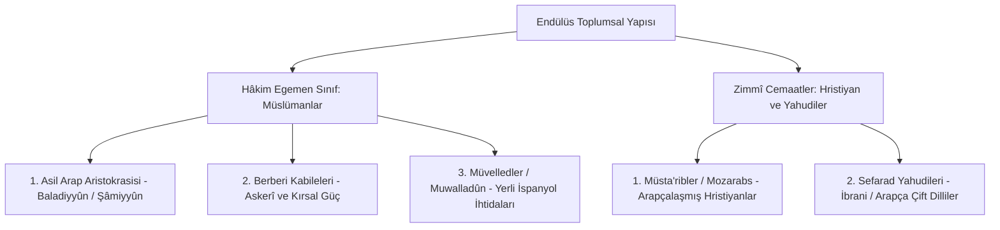

# Convivencia (Birlikte Yaşama) Söyleminin Tenkidi: Romantik Efsane ile Tarihsel Gerçeklik Arasında Endülüs Toplumsal Katmanlaşması

> **Araştırma Alanı:** Sosyal Tarih, Dinlerarası Hukuk (Zimmî Statüsü), İdeolojik Tarihyazımı Tenkidi  
> **Temel Ekoller:** Américo Castro (Romantik Convivencia Tezi) vs. Claudio Sánchez-Albornoz & Serafín Fanjul (Polemik/Çatışma Tezi) vs. Modern Akademik Konsensüs (Glick, Constable, Fierro)  
> **Hedef:** 19. ve 20. yüzyıl romantik hümanizmi tarafından inşa edilen "üç dinin mutlak eşitlik içinde yaşadığı cennet Endülüs" mitini ve buna karşı üretilen "sürekli kanlı çatışma" tezini eleştirel birincil belgelerle çözümlemek.

---

## 1. Giriş ve Kavramsal Arka Plan

1948 yılında İspanyol filolog **Américo Castro**, *España en su historia* adlı eserinde İber Yarımadası'ndaki Müslüman, Yahudi ve Hristiyanların bir arada yaşamasını **"Convivencia" (birlikte yaşama / birlikte var olma)** kavramıyla formüle etti. Bu kavram zamanla popüler kültürde ve siyasi söylemlerde 21. yüzyılın seküler çoğulculuğu, modern toleransı ve eşit vatandaşlığı gibi anokronik bir biçimde sunulmaya başlandı.

Ancak tarihsel belgeler (fetvalar, hisbe kılavuzları, fıkıh mecmuaları ve kilise kronikleri) incelendiğinde; Endülüs toplumunun ne romantik bir "medeniyetler ittifakı ütopyası" ne de kesintisiz bir "engizisyon öncesi cehennem" olduğu görülür. Endülüs, İslam hukukunun **zimmî (*dhimmi*)** akdi çerçevesinde tanımlanmış hiyerarşik, pragmatik ve dinamik bir **hukuki koalisyondur**.

---

## 2. Hukuki Statü ve Dinlerarası Sınırlar

### 2.1. Zimmî Hukuku ve Cizye Sözleşmesi
Hristiyanlar ve Yahudiler, "Ehl-i Kitap" olarak can ve mal emniyetine, ibadet serbestisine ve kendi cemaat mahkemelerine (piskoposluk ve hahambaşılık) sahiptiler. Bunun karşılığında devlete **cizye** (*kişi başına vergi*) ve **harac** (*toprak vergisi*) ödüyorlardı.

### 2.2. Sosyal Sınırlar ve Hisbe Kılavuzları
İbn Abdûn'un (12. yy başı Sevilla) *Hisbe Risalesi* gibi belediye ve çarşı zabıtası metinlerinde görüldüğü üzere; gayrimüslimlerin Müslüman kadınlarla evlenmesi, Müslümanlardan daha yüksek evler inşa etmesi veya dini ayinlerini sokaklarda yüksek sesle icra etmesi sınırlandırılmıştı.

### 2.3. Toplumsal Krizler ve Kırılma Noktaları
Tarih boyunca gerilimler mutlak bir barış olmadığını kanıtlar:
1. **Kurtuba Gönüllü Şehitleri Hareketi (850–859 CE):** Eulogius ve Alvaro öncülüğünde bir grup radikal Hristiyanın kasten Hz. Muhammed'e hakaret ederek idam edilmeyi talep etmesi.
2. **1066 Granada Yahudi Katliamı:** Zîrî emiri Bâdîs'in Yahudi veziri İsmâil ve Yûsuf bin Nağrîle'nin (Samuel ha-Nagid) aşırı siyasi güç kazanması üzerine patlak veren isyan.
3. **Muvahhidler Devri (1146 sonrası):** Radikal teolojik politikalar neticesinde bazı Hristiyan ve Yahudi cemaatlerin kuzey Hristiyan krallıklarına göç etmesi (Musa bin Meymun / Maimonides'in Mısır'a hicreti).

---

## 3. Kültürel Entegrasyon ve "Altın Çağ" Gerçeği

Convivencia'nın en somut ve inkar edilemez başarısı **entelektüel ve bilimsel simbiyozdur**:

| Toplumsal Katman | İcra Ettiği Fonksiyon | Medeniyet Mirası |
| :--- | :--- | :--- |
| **Sefarad Yahudileri** | Saray hekimliği, astronomi, vergi mültezimliği, diplomatik elçilikler. | İbrani edebiyatının ve gramerinin Arapça kalıplarla yeniden doğuşu (*Hasday bin Şaprut, İbn Cebirol, Yehuda Halevi*). |
| **Müsta'ribler (Mozarabs)** | Çift dilli kâtiplik, tercüme, tarım tekniklerinin intikali. | İspanyol diline giren 4.000'den fazla Arapça kelime; Latin-Arap çift dilli İncil metinleri. |
| **Müvelledler (Muwallads)** | İber kökenli Müslüman çoğunluk; zanaat, ordu ve bürokrasi. | İberya'nın yerel geleneklerinin İslam şehirciliğiyle sentezlenmesi. |

---

## 4. Sonuç ve Metodolojik Hüküm

Endülüs'teki birlikte yaşama tecrübesi; **ne modern bir liberal demokrasi ütopyası ne de kesintisiz bir zulüm tarihidir**. O, Orta Çağ feodal Avrupası'nın kanlı cüzzamlı, Yahudi ve heretik yakma fırınlarıyla kıyaslandığında; Akdeniz havzasında o döneme kadar görülmüş **en işlevsel, en üretken ve en uzun ömürlü çok dinli medeniyet düzenidir**.

---

## 5. Kaynakça

- **Castro, Américo**, *España en su historia: Cristianos, moros y judíos*, Buenos Aires: Losada, 1948.
- **Sánchez-Albornoz, Claudio**, *España, un enigma histórico*, Buenos Aires, 1956.
- **Glick, Thomas F.**, *Islamic and Christian Spain in the Early Middle Ages*, Princeton University Press, 1979.
- **Fierro, Maribel**, *The Almohad Revolution: Politics and Religion in the Islamic West*, Ashgate, 2012.
- **Fanjul, Serafín**, *Al-Ándalus contra España: La forja del mito*, Madrid: Siglo XXI, 2000.
- **Constable, Olivia Remie (ed.)**, *Medieval Iberia: Readings from Christian, Muslim, and Jewish Sources*, University of Pennsylvania Press, 2011.
