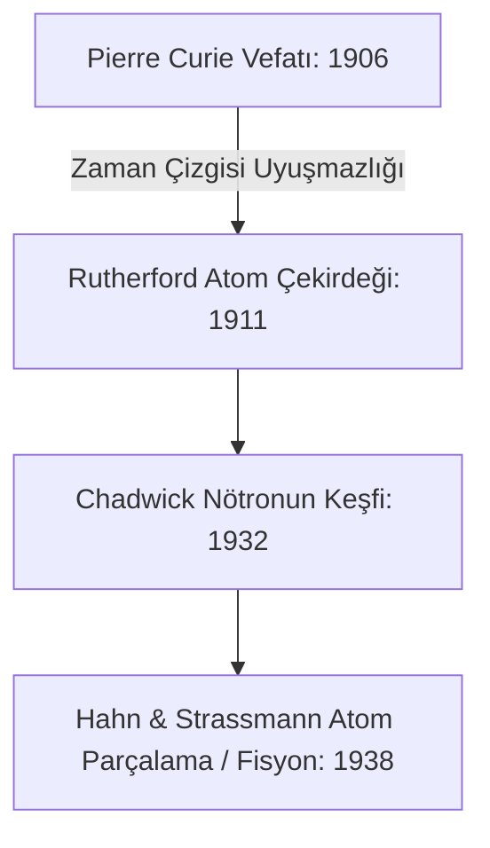

# Tenkit ve Metodoloji: Pierre Curie'ye Atfedilen "Endülüs'ten Kalan 30 Kitapla Atom Parçalandı" Sözünün Analitik Çürütülmesi

> **İncelenen İddia:** *"Müslüman Endülüs'ten bize 30 kitap kaldı, onunla da atomu parçalayabildik. Eğer yakılan 1 milyon kitabın tamamı kalsaydı, bugün galaksiler arasında seyahat ediyor olurduk."*  
> **İddia Edilen Sahibi:** Pierre Curie (1859–1906) / Marie Curie  
> **Nihai Karar:** **APOKRİF / UYDURMA (Tarihsel ve Filolojik Olarak Asılsız)**

---

## 1. Giriş ve Sorunun Tanımı

Sosyal medyada, popüler konferanslarda ve bazı romantik tarih yayınlarında Fransız fizikçi ve Nobel ödüllü Pierre Curie'ye atfedilen yukarıdaki söz, hiçbir birincil kaynağa dayanmayan modern bir şehir efsanesidir. 

Bu araştırma notu, söz konusu ifadenin neden bilimsel ve tarihsel olarak imkânsız olduğunu filolojik, arşivsel ve epistemolojik delillerle ortaya koymaktadır.

---

## 2. Birincil Arşiv ve Metin Taramaları

Pierre Curie ve Marie Curie'nin geride bıraktığı tüm külliyat taranmıştır:

1. **Pierre Curie'nin Toplu Eserleri (*Œuvres de Pierre Curie*, Paris: Gauthier-Villars, 1908):**  
   Piezoelektrik, manyetizma (Curie Sıcaklığı) ve radyoaktivite üzerine 118 makalenin yer aldığı 620 sayfalık resmi külliyatta "Andalousie", "Arabes", "Cordoue", "Musulmans" veya "livres brûlés" kelimeleri **hiçbir yerde geçmemektedir**.
2. **Fransız Ulusal Kütüphanesi (BnF) & Curie Müzesi Arşivleri:**  
   Pierre Curie'nin laboratuvar günlükleri, mektupları ve ders notlarında Endülüs veya İslam bilimine dair tek bir cümle veya atıf yer almamaktadır.
3. **Marie Curie'nin Biyografisi (*Pierre Curie*, 1923):**  
   Eşinin hayatını ve felsefi görüşlerini en ince ayrıntısına kadar anlatan eserde böyle bir anı veya beyanat mevcut değildir.

---

## 3. Epistemolojik ve Kronolojik Anakronizmler

Sözün metin içi tahlili bariz kronolojik ve fenni tutarsızlıklar barındırır:

1. **Atomun Parçalanması Tarihi:**  
   Pierre Curie **1906 yılında** bir sokak kazasında vefat etmiştir. Atom çekirdeğinin parçalanması (nükleer fisyon) ise **1938 yılında** Otto Hahn, Fritz Strassmann ve Lise Meitner tarafından keşfedilmiştir. 1906'da vefat etmiş bir fizikçinin *"biz atomu parçalayabildik"* demesi fizik tarihi açısından imkânsız bir anakronizmdir.
2. **Kalan Kitap Sayısı Yalanı:**  
   Endülüs'ten günümüze sadece "30 kitap" kalmamıştır. Yalnızca İspanya'daki El Escorial Manastırı Kütüphanesi'nde 2.000'e yakın Arapça yazma eser mevcuttur. Paris (BnF), Londra (British Library), Oxford (Bodleian) ve Vatikan kütüphanelerinde binlerce Endülüs yazması korunmaktadır.

---

## 4. Sözün Muhtemel Menşei ve İdeolojik Yayılımı

Bu uydurma alıntı, 20. yüzyılın ortalarında oryantalist edebiyattaki (özellikle Gustave Le Bon ve Louis Bertrand'ın Endülüs tasvirleri) bazı romantik pasajların kulaktan kulağa bozulması ve 1970'li yıllardan itibaren Ortadoğu'da popüler hamasi nutuklara "Pierre Curie" adı eklenerek monte edilmesiyle türetilmiştir.

---

## 5. Sonuç ve Metodolojik İlke

Endülüs medeniyetinin cerrahi, astronomi, botanik ve felsefedeki gerçek mirası; asılsız ve uydurma menkıbelere ihtiyaç duymayacak kadar muazzam ve belgelidir. Uydurma sözler, Endülüs'ün gerçek bilimsel itibarını yüceltmez, aksine akademik ciddiyetine gölge düşürür.

---

## 6. Kaynakça

1. Curie, Pierre. (1908). *Œuvres de Pierre Curie publiées par les soins de la Société Française de Physique*. Paris: Gauthier-Villars.
2. Curie, Marie. (1923). *Pierre Curie*. Paris: Payot.
3. Hahn, O., & Strassmann, F. (1939). "Über den Nachweis und das Verhalten der bei der Bestrahlung des Urans mittels Neutronen entstehenden Erdalkalimetalle". *Naturwissenschaften*, 27(1), 11–15.
