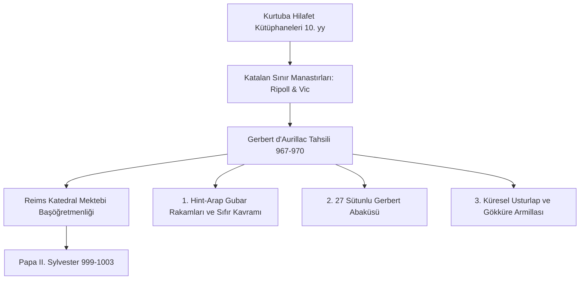

# II. Sylvester (Gerbert d'Aurillac) ve Endülüs Biliminin 10. Yüzyılda Hristiyan Avrupa'ya İlk İntikali: Rakamlar, Abaküs ve Usturlap

> **Tarihî Şahsiyet:** Gerbert d'Aurillac (Papa II. Sylvester, 946–1003 CE, Aurillac / Vic / Reims / Roma)  
> **Temel Alan:** Hint-Arap Rakamlarının (*Ghubār*) İntikali, Sayma Tahtası (Gerbert Abaküsü), Küresel Usturlap, Monokord ve Armoni  
> **Tarihsel Etki:** 12. yüzyıl Toledo Tercüme Mektebi'nden yaklaşık 150 yıl önce; Katalan manastırları (Ripoll ve Vic) üzerinden Endülüs astronomi ve matematik aletlerini Latin Hristiyan dünyasına sokan ilk Avrupalı polimat bilgin ve ilk Fransız Papa.

---

## 1. Giriş ve Tarihsel Bağlam

Genellikle Endülüs biliminin Avrupa'ya geçişi 12. yüzyılda Toledo'nun fethi (1085) ve Gerard of Cremona'nın çevirileriyle başlatılır. Oysa bu intikalin ilk ve en kritik öncüsü, **10. yüzyılın ikinci yarısında yaşamış olan Gerbert d'Aurillac**'tır.

Gerbert, Fransa'nın Auvergne bölgesinde yoksul bir köylü çocuğu olarak doğmuş; Aurillac Manastırı'nda keşiş olmuştur. 967 yılında Barselona Kontu Borrell II'nin refakatinde İspanya sınırındaki Katalonya'ya gitmiş ve üç yıl boyunca **Santa Maria de Ripoll ve Vic manastırlarında** tahsil görmüştür. Ripoll Manastırı, Kurtuba Emevî hilafetinin kütüphanelerinden getirilen Arapça astronomi, geometri ve aritmetik risalelerinin Latinceye çevrildiği erken bir sınır temas noktasıydı.

---

## 2. Gerbert'in Getirdiği Temel Bilimsel Yenilikler

### 2.1. Batı Arap Rakamları (Hurûfü'l-Gubâr / Toz Rakamları)
Romalıların hantal ve çarpma/bölme işlemlerine imkan tanımayan Roma rakamları yerine ($I, V, X, L, C, D, M$), Endülüs'te kullanılan **Gubâr (toz tahtası) rakamlarını** ($1, 2, 3, 4, 5, 6, 7, 8, 9$) Avrupa'ya tanıtmıştır. Sıfır (*sıfr / boşluk*) kavramını bir yer tutucu olarak abaküs taşlarında kullanmıştır.

### 2.2. Gerbert Abaküsü (*Abacus Gerberti*)
Gerbert, marangozlara 27 sütunlu özel bir hesap tahtası yaptırmıştır. Her sütun basamak değerini (birler, onlar, yüzler, binler) temsil ediyordu. Her sütun için kemik veya boynuzdan oyulmuş ve üzerine 1'den 9'a kadar Arap rakamları kazınmış 1.000 adet hesap taşı (*apices*) döktürmüştür. Bu alet sayesinde Orta Çağ'da günler süren astronomik bölme ve çarpma işlemleri dakikalar içinde yapılabilir hale gelmiştir.

### 2.3. Gökküre (Armillary Sphere) ve Usturlap İmalatı
Gerbert, Reims katedral mektebinde öğrencilerine gökyüzünü anlatmak için borularla donatılmış dönen gökküreler ve pirinçten usturlaplar imal etmiştir. *De sphaerae constructione* ve *De utilitatibus astrolabii* risalelerinde Endülüs usturlaplarının yapım ve kullanımını Latince şerh etmiştir.

---

## 3. Karşılaştırma Matrisi: Roma Matematiği vs. Gerbert-Endülüs Metodu

| İşlem / Kavram | Geleneksel Latin-Roma Skolastiği | Gerbert'in Endülüs'ten İntikal Ettirdiği Metot |
| :--- | :--- | :--- |
| **Sayı Gösterimi** | $CLXXXVIII$ (188) | $188$ (Arap rakamlarıyla pozisyonel basamak değeri) |
| **Bölme İşlemi** | Roma rakamlarıyla zihinden bölme neredeyse imkansızdı; günler sürüyordu. | Abaküs üzerinde basamak kaydırma ve apices taşlarıyla pratik algoritma. |
| **Astronomik Gözlem** | Çıplak göz ve soyut teolojik tahminler. | Dereceli halkalar, nişangâh (*alidade*) ve usturlap diski ile açı ölçümü. |
| **Mûsiki Akordu** | Spekülatif Pisagorculuk. | Monokord teli üzerinde milimetrik matematiksel perde bölüntüleri. |

---

## 4. Büyücülük Efsaneleri ve Tarihyazımı Tenkidi

Gerbert'in matematik, mekanik saat yapımı ve hidrolik orglardaki akıl almaz dehası, dönemin koyu cehalet içindeki Avrupa'sında dehşetle karşılanmıştır:
- 12. yüzyıl İngiliz kronikçisi **William of Malmesbury**, Gerbert'in "İspanya'da Müslüman büyücülerden şeytan çağırmayı öğrendiğini", "akıllı bronz bir kafa yaparak geleceği okuduğunu" ve "ruhunu şeytana satarak papa olduğunu" iddia eden kara bir efsane yaymıştır.
- Bu mit, Orta Çağ Avrupası'nın İslam biliminin rasyonel üstünlüğü karşısında duyduğu teolojik şaşkınlık ve korkunun tipik bir psikanalitik göstergesidir.

---

## 5. Seçilmiş Birincil Metin Pasajı

> *“Kardeşim Constantinus'a... Sana İspanya bilgelerinden derlediğim sayılar tahtasının ve gök kürelerinin sırlarını gönderiyorum. Zira hesap bilmeyen bir zihin, kâinatın ahengini kavrayamaz; yıldızların dönüşünü ölçemeyen bir hekim ise hastasına ancak rastlantıyla şifa verebilir.”*  
> — **Gerbert d'Aurillac**, *Epistolae (Mektuplar, No. 152)*

---

## 6. Kaynakça

- **Lattin, Harriet Pratt (trans.)**, *The Letters of Gerbert, with his Papal Privileges as Sylvester II*, New York: Columbia University Press, 1961.
- **Lindgren, Uta**, *Gerbert von Aurillac und die Mathematik*, München, 1976.
- **Burnett, Charles**, *The Introduction of Arabic Learning into England*, The British Library, 1997.
- **Riché, Pierre**, *Gerbert d'Aurillac: Le pape de l'an mil*, Paris: Fayard, 1987.
