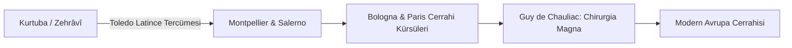

# Endülüs Cerrahisinin Avrupa'ya İntikali: Salerno, Montpellier ve Bologna Tıp Ekolleri

> **Konu:** Ebû'l-Kâsım ez-Zehrâvî ve İbn Zühr'ün cerrahi metinlerinin Salerno Tıp Okulu, Montpellier ve Bologna Üniversitelerine aktarımı, berber-cerrahlıktan akademik cerrahiye geçiş.

---

## 1. Orta Çağ Avrupası'nda Cerrahinin Konumu

12. yüzyıla kadar Latin Avrupa'da cerrahi, tıp fakültelerinde okutulmayan; cellatlar, berberler ve gezgin hacamatçılar tarafından yürütülen kanlı ve tehlikeli bir el işi (*empiricus*) olarak görülüyordu. 1163 Tours Konsili'nin *"Ecclesia abhorret a sanguine"* (Kilise kandan nefret eder) kararıyla din adamlarının cerrahi yapması yasaklanmıştı.

---

## 2. Zehrâvî Devrimi ve Montpellier Kürsüsü

Toledo'da Gerard of Cremona'nın Zehrâvî'nin *Kitâbü't-Tasrîf* 30. Makalesini *Chirurgia Albucasis* olarak tercüme etmesiyle birlikte cerrahi, teorik tıp tahsilinin ayrılmaz bir parçası haline geldi.

### Montpellier Tıp Fakültesi
Montpellier, İspanya sınırına yakınlığı ve Arapça tıp metinlerini doğrudan benimsemesi sayesinde Avrupa'nın en saygın cerrahi merkezi oldu. Guy de Chauliac (1300–1368), yazdığı *Chirurgia Magna* adlı başyapıtında Zehrâvî'yi 200'den fazla yerde kaynak göstererek *"Cerrahi tahsilimizin babası"* ilan etmiştir.

---

## 3. Kaynakça

1. Jacquart, Danielle. (1998). *La médecine médiévale dans le cadre parisien*. Paris: Fayard.
2. McVaugh, Michael R. (1993). *Medicine before the Plague: Practitioners and Their Patients in the Crown of Aragon, 1285–1345*. Cambridge University Press.
