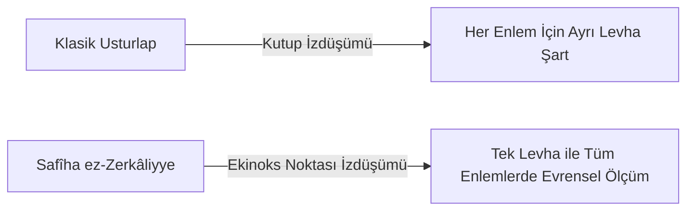

# İbnü'z-Zerkâle (Arzachel) ve Safîha ez-Zerkâliyye: Evrensel Usturlap, Zîcler ve Güneş Teorisi

> **Yazar:** Ebû İshâk İbrâhîm bin Yahyâ ez-Zerkâlî (1029–1087 CE, Toledo / Kurtuba)  
> **Temel Eserler:** *Risâletü's-Safîhati'z-Zerkâliyye* (Azafea), *ez-Zîcü't-Tuleytulî* (Toledo Tables), *Kitâbü'l-Amel bi's-Sahîfe*  
> **Disiplin:** Gözlemsel Astronomi, Küresel Geometri, Enstrümantasyon, Ekvatoryum Mekaniği  
> **Tarihsel Etki:** Kopernik *De revolutionibus* adlı eserinde Zerkâle'nin gözlemlerini referans göstermiş; Toledo Cetvelleri Avrupa'da 150 yıl boyunca standart gök efemerisi olmuştur.

---

## 1. Giriş ve Toledo Astronomi Okulu

Zerkâle, Benî Zü'n-Nûn hanedanı döneminde Toledo'da (Tuleytula) kurulan rasathanenin başına geçti. Bir kuyumcu ve hassas mekanik ustası olarak başladığı kariyerini, Orta Çağ dünyasının en büyük gözlemci astronomu olarak tamamladı.

---

## 2. Temel Astronomik ve Mekanik İcatlar

### 2.1. Evrensel Usturlap (es-Safîha ez-Zerkâliyye / Saphaea Arzachelis)
Geleneksel usturlaplar her enlem için ayrı bir pirinç disk (*safîha*) gerektirirken; Zerkâle, stereografik izdüşümü ilkbahar ekinoksu noktasına odaklayarak **dünyanın her yerinde ve her enlemde tek bir levha ile çalışan evrensel usturlabı (Azafea)** icat etmiştir.

### 2.2. Güneş Evcinin (Apogee) Öz Hareketi
Batlamyus güneş evcinin yıldızlara göre sabit olduğunu varsayıyordu. Zerkâle, 25 yılı aşan hassas gözlemleri neticesinde Güneş evcinin yıldız küresine göre yılda 12.04 yay saniyesi hızla hareket ettiğini ispatlamıştır (modern ölçüm: 11.46 yay saniyesi).

### 2.3. Toledo Su Saatleri (el-Mekânâtü'l-Mâiyye)
Tagus (Tajo) nehri kıyısında inşa ettiği iki hidrolik su saati havuzu; ayın hilal, ilk dördün, dolunay ve son dördün evrelerine göre su seviyesini otomatik olarak yükseltip alçaltan hidro-mekanik bir otomasyon şaheseriydi.

---

## 3. Tuleytula Cetvelleri (Toledo Tables)

Batlamyus, el-Hârizmî ve el-Bettânî'nin parametrelerini Toledo'nun boylamına göre yeniden hesaplamış; Akdeniz'in boylam uzunluğundaki Batlamyus hatasını (62 dereceden 42 dereceye) düzelterek coğrafi haritacılıkta devrim yapmıştır.

---

## 4. Kaynakça

1. **El Escorial:** *MS Árabe 903* (*Al-Zīj al-Ṭulayṭulī*).
2. Toomer, G. J. (1969). "The Solar Theory of az-Zarqāl: A History of Errors". *Centaurus*, 14(1), 306–336.
3. Puig, Roser. (1987). *Los Tratados de la Azafea*. Madrid: Instituto Hispano-Árabe de Cultura.
