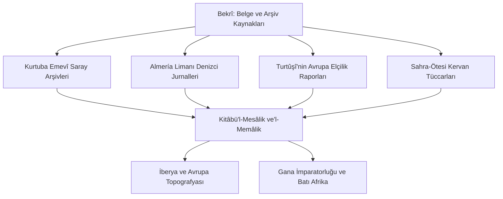

# Ebû Ubeyd el-Bekrî ve Kitâbü'l-Mesâlik ve'l-Memâlik: İberya, Kuzey Afrika ve Sahra-Ötesi Ticaret Coğrafyası

> **Yazar:** Ebû Ubeyd Abdullâh bin Abdilazîz el-Bekrî el-Kurtubî (1014–1094 CE, Huelva / Kurtuba / Almería)  
> **Temel Eser:** *Kitâbü'l-Mesâlik ve'l-Memâlik* (كتاب المسالك والممالك) ve *Mu'cemü Mesta'cem* (معجم ما استعجم)  
> **Disiplin:** Tarihî Coğrafya, Toponimi, Etnografya, Sahra-Ötesi Ticaret Yolları  
> **Tarihsel Etki:** İber Yarımadası'nın yerel toponomisi ile Orta Çağ Batı Afrika'sının (Gana İmparatorluğu, Sudan havzası) altın ticaret yollarını ve kentlerini belgeleyen en eski ve en muteber birincil kaynak.

---

## 1. Giriş ve Tarihsel Arka Plan

Ebû Ubeyd el-Bekrî, Endülüs'ün Mülûkü't-Tavâif (Beylikler) devrinde yaşamış polimat bir coğrafyacı, tarihçi ve filologdur. Saltalash valisi olan babasının yanında saray terbiyesi almış; Kurtuba'da İbn Hazm ve dönemin büyük dilbilimcilerinden ders görmüştür.

Bekrî, hayatı boyunca İspanya dışına seyahat etmemesine rağmen; Kurtuba ve Almería kütüphanelerindeki resmi arşivleri, Endülüs Emevî hilafetinin diplomatik elçilik raporlarını (*özellikle İbrâhim b. Ya'kûb et-Turtûşî'nin Orta ve Doğu Avrupa raporlarını*), Sahra kervan tüccarlarının ve denizcilerin ifadelerini eşsiz bir tenkit süzgecinden geçirerek ansiklopedik bir coğrafya külliyatı telif etmiştir.

---

## 2. Coğrafi ve Etnografik Keşifler

### 2.1. Orta Çağ Gana İmparatorluğu'nun (Kûmbî Sâlih) Tespiti
Bekrî'nin eseri, günümüz Moritanya ve Mali topraklarında hüküm süren antik **Gana Krallığı** hakkında yazılı tarihteki en detaylı tasviri sunar. Başkent Kûmbî Sâlih'in iki ayrı yerleşimden oluştuğunu; bir tarafta putperest kralın taş sarayı ve kutsal koruluğunun, 6 mil ötede ise 12 camili Müslüman tüccar mahallesinin yer aldığını belgelemiştir.

### 2.2. Altın Ticareti ve Sahra Kervan Yolları
Sijilmassa'dan (Fas) yola çıkan kervanların Awdaghost ve Kûmbî Sâlih üzerinden Senegal ve Nijer nehirleri havzasındaki altın madenlerine uzanan 2 aylık çöl geçişlerini, su kuyularının konumlarını, deve kervanlarının yük kapasitelerini ve tuz-altın takas mekanizmasını milimetrik olarak tarif etmiştir.

### 2.3. İber Yarımadası Toponimisi ve Yol Ağları
*Mu'cemü Mesta'cem* eserinde, İber Yarımadası'ndaki Latince, Kelt-İber ve Arapça yer isimlerinin etimolojisini, nehir debilerini, kalelerin muhasara dayanıklılıklarını ve tarım arazilerinin verimliliğini listelemiştir.

---

## 3. Bölgesel Kayıtlar ve Analitik Veri Tablosu

| Bölge / Krallık | Bekrî'nin Eserindeki Stratejik Kayıt | Tarihî Önemi |
| :--- | :--- | :--- |
| **Gana Krallığı (Kûmbî Sâlih)** | Kralın altın süslemeli köpekleri, 200.000 kişilik ordusu, altın tozu vergileri ve adalet mahkemeleri. | Batı Afrika proto-tarihinin arkeolojik olarak doğrulanan en eski yazılı belgesidir. |
| **İslav Toprakları & Prag** | İbrahim b. Ya'kûb'un 965 yılı raporu: Prag'ın taş yapılı binaları, tuz madenleri ve Rus-İslav kürk ticareti. | Çekya ve Polonya tarihinin en eski birinci elden şehir tasvirlerinden biridir. |
| **İber Yarımadası Kaleleri** | Kurtuba-Toledo-Zaragoza arasındaki Roma taş yolları ve Müslüman ribâtlarının lojistik mesafeleri. | Reconquista askeri harekâtlarının ve yol topografyasının haritasını çıkarır. |

---

## 4. Modern Neşirler ve Batı Akademisindeki Yeri

1. **Baron de Slane Fransızca Neşri (1859):** *Description de l'Afrique septentrionale par el-Bekri*, Paris: Imprimerie Impériale.
2. **Hopkins & Levtzion Çevirisi (1981):** *Corpus of Early Arabic Sources for West African History*, Cambridge University Press.
3. **UNESCO Afrika Genel Tarihi:** Bekrî'nin metinleri UNESCO'nun Sahra altı Afrika tarihi araştırmalarının birincil omurgasını teşkil etmiştir.

---

## 5. Seçilmiş Birincil Metin Pasajı

> *“Gana kralının şehri iki kısımdan oluşur: Biri Müslümanların oturduğu şehirdir; burada on iki cami vardır, camilerden birinde cuma namazı kılınır. Şehirde fakihler, âlimler ve tüccarlar ikamet eder... Kralın şehri ise altı mil mesafededir. Kral adalet meclisi kurduğunda altın başlıklı sarıklar takmış nöbetçiler bekler, atlarının sırtı altın örtülerle bezenmiştir. Önünde içi saf altın külçeleriyle dolu çanaklar durur.”*  
> — **Ebû Ubeyd el-Bekrî**, *Kitâbü'l-Mesâlik ve'l-Memâlik*

---

## 6. Kaynakça

- **De Slane, Baron (ed. & trans.)**, *Description de l'Afrique Septentrionale par Abou-Obeid-el-Bekri*, Paris, 1859 (Repr. 1965).
- **Levtzion, N. & Hopkins, J. F. P.**, *Corpus of Early Arabic Sources for West African History*, Cambridge: Cambridge University Press, 1981.
- **Vernet, J.**, *La ciencia en al-Andalus*, Madrid: MAPFRE, 1999.
- **Sezgin, Fuat**, *Geschichte des arabischen Schrifttums (Band X-XII: Mathematische Geographie und Kartographie)*, Frankfurt: IGMS, 2000.
