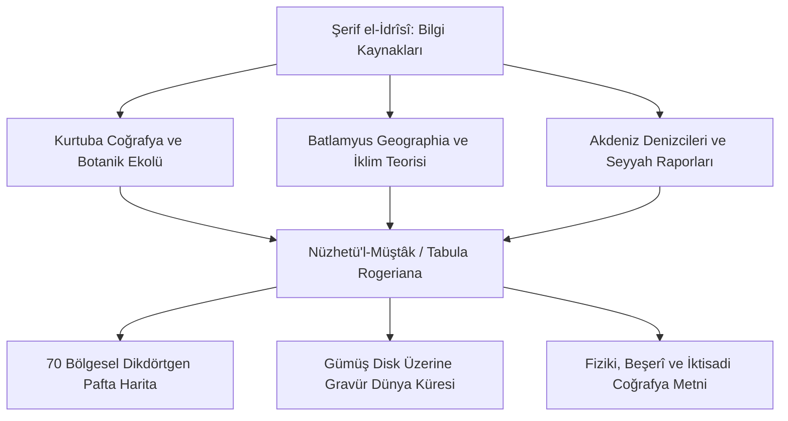

# Şerif el-İdrîsî (Dreses) ve Nüzhetü'l-Müştâk: Küresel Kartografya, 7 İklim Kuşağı ve Tabula Rogeriana

> **Yazar:** Ebû Abdillâh Muhammed bin Muhammed eş-Şerîf el-İdrîsî (1100–1165 CE, Sebte [Ceuta] / Kurtuba / Palermo)  
> **Temel Eser:** *Nüzhetü'l-Müştâk fî İhtirâkı'l-Âfâk* (نزهة المشتاق في اختراق الآفاق / *Kitâb-ı Rucer* [Tabula Rogeriana])  
> **Disiplin:** Küresel Kartografya, Fiziki ve Beşerî Coğrafya, Geodezi, Denizcilik Güzergâhları  
> **Tarihsel Etki:** Orta Çağ İslam ve Hristiyan dünyasının en kapsamlı ve gerçeğe en yakın dünya haritası; 70 bölgesel harita paftası ve gümüş planiküre küre dökümü. 1592'de Roma'da Medici Matbaası tarafından basılmıştır.

---

## 1. Giriş ve Tarihsel Bağlam

Şerif el-İdrîsî, Kuzey Afrika'nın Sebte (Ceuta) şehrinde doğmuş, Endülüs'ün ilim başkenti **Kurtuba'da** astronomi, matematik, botanik ve coğrafya tahsil etmiştir. Gençlik yıllarında İberya, Kuzey Afrika, Fransa ve Anadolu sahillerini bizzat dolaşarak saha gözlemleri yapmıştır.

1138 civarında Norman Kralı II. Roger'ın davetiyle Sicilya'nın Palermo sarayına gitmiş ve burada 15 yılı aşkın bir süre boyunca antik Grek coğrafyacısı Batlamyus'un (*Ptolemaios*) verilerini, İslam coğrafyacılarının (*Belhî, İbn Havkal, Mes'ûdî*) seyahat kayıtlarını ve bizzat limanlardan toplanan denizci jurnallerini sentezleyerek Orta Çağ'ın en muazzam coğrafya anıtını meydana getirmiştir.

---

## 2. Metodolojik Yenilikler ve Kartografik Mimarî

### 2.1. Yedi İklim Kuşağı ve Bölgesel Paftalama Sistemi
İdrîsî, bilinen dünyayı (Ekvator'dan kuzey kutup dairesine kadar) 7 enlemsel iklim kuşağına (*iklîm*) ayırmış; her kuşağı da batıdan doğuya (Atlas Okyanusu'ndan Çin Denizi'ne) doğru 10 dikey bölüme (*cüz'*) bölmüştür. Böylece toplam **70 dikdörtgen pafta harita** elde edilmiş ve bunlar birleştirildiğinde devasa bir dünya atlası teşkil etmiştir.

### 2.2. Gümüş Planisfer (Tabula Rogeriana)
Harita metnine eşlik etmek üzere, yaklaşık 2 metre çapında ve 400 libre ağırlığında saf gümüş bir disk üzerine o dönemin bilinen kıtaları, dağ silsileleri, nehir havzaları, ticaret limanları ve kent merkezleri mikrometrik gravür tekniğiyle işlenmiştir.

### 2.3. Güneyi Üstte Gösteren Klasik İslam Yönelimi
İslam kartografya geleneğine uygun olarak İdrîsî haritalarında **Güney yönü üstte**, **Kuzey yönü altta** konumlandırılmıştır. Akdeniz havzası, İber Yarımadası, Cebelitarık Boğazı ve İtalya şaşırtıcı bir topografik doğrulukla çizilmiştir.

---

## 3. Coğrafi Detay ve Doğruluk Matrisi

| Coğrafi Bölge | İdrîsî'nin Tespiti ve Tasviri | Orta Çağ Batı Haritalarıyla (Mappa Mundi) Karşılaştırma |
| :--- | :--- | :--- |
| **İber Yarımadası & Endülüs** | Nehir yatakları (Guadalquivir, Tajo, Ebro), dağ geçitleri, sulama kanalları ve surlu şehirler tam ölçekli. | T-O haritalarında İspanya belirsiz bir sınır şeridinden ibaretken, İdrîsî'de 100'den fazla şehir adı kaydedilmiştir. |
| **Nil Nehri Kaynakları** | Nil'in ekvatorun güneyindeki "Ay Dağları"ndan (*Cebelü'l-Kamer*) doğduğunu ve göller havzasından beslendiğini tespit etmiştir. | 19. yüzyıl Viktorya dönemi kaşiflerinin (Speke, Burton) "keşfettiği" Viktorya Gölü kaynaklarını 700 yıl önce haritalandırmıştır. |
| **Britanya ve İskandinavya** | İngiltere, İskoçya, İrlanda kıyıları ve Baltık Denizi ticaret limanları detaylı kaydedilmiştir. | Çağdaş Avrupa haritalarına kıyasla kuzey denizleri rotalarında benzersiz liman mesafeleri sunar. |
| **Afrika Sahilleri** | Batı Afrika kıyıları ve Sahra-ötesi tuz-altın ticaret güzergâhları (Gana Krallığı) belgelenmiştir. | Afrika'nın güneye doğru büküldüğü ve denizle çevrili olduğu açıkça gösterilmiştir. |

---

## 4. Latinceye ve Avrupa'ya İntikali

1. **Sicilya ve İtalyan Denizcileri:** İdrîsî'nin kartografik verileri Venedik ve Cenova denizcilerinin portulan (*portolan*) haritalarının gelişimine doğrudan zemin hazırlamıştır.
2. **Medici Matbaası Baskısı (1592):** Eserin Arapça özeti *De Geographia Universali* adıyla Roma'da basılmış; 1619'da Gabriel Sionita ve Johannes Hesronita tarafından *Geographia Nubiensis* başlığıyla Latinceye çevrilmiştir.
3. **Coğrafi Keşifler Çağı:** Kristof Kolomb ve Vasco da Gama'nın seyrüsefer öncesinde incelediği küresel kıta projeksiyonları İdrîsî'nin hesaplamalarına dayanmaktaydı.

---

## 5. Seçilmiş Birincil Metin Pasajı

> *“Yeryüzü, suyun üzerinde yüzdüğü halde hava ile çevrilidir; tıpkı bir yumurtanın sarısının akının tam ortasında durması gibi... Güneş ve gök cisimleri onun çevresinde döner. Ekvator hattından kuzeye doğru yedi iklim kuşağı uzanır; her iklim kendi nehirleri, dağları, şehirleri ve halklarının mizaçlarıyla ayrışır.”*  
> — **Şerif el-İdrîsî**, *Nüzhetü'l-Müştâk Mukaddimesi*

---

## 6. Kaynakça ve Tenkitli Neşirler

- **Ahmad, S. Maqbul**, *India and the Neighbouring Territories in the Kitāb Nuzhat al-Mushtāq*, Leiden: Brill, 1960.
- **Cerulli, E. et al. (ed.)**, *Opus Geographicum: Al-Idrīsī, Nuzhat al-mushtāq fī ikhtirāq al-āfāq*, 9 Cilt, Napoli-Roma: Istituto Universitario Orientale, 1970–1984.
- **Harley, J. B. & Woodward, D.**, *The History of Cartography, Vol. 2, Book 1: Cartography in the Traditional Islamic and South Asian Societies*, University of Chicago Press, 1992.
- **Ducène, J.-C.**, *L'Afrique dans les cartes d'al-Idrīsī: du texte à l'image*, Journal of African History, 2011.
