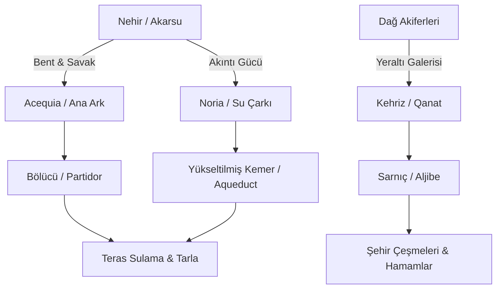

# Endülüs Hidrolik Mühendisliği: Su Dolapları (Noria), Kehrizler, Acequia Şebekeleri ve Su Mahkemeleri

> **Mühendislik Havzası:** Guadalquivir (Vâdî el-Kebîr), Segura, Turia ve Genil Nehir Havzaları  
> **Temel Sistemler:** Noria (Su Dolabı), Acequia (es-Sâkıye), Kehriz / Qanat (el-Kât), Qanâtir (Su Kemerleri), Sarnıçlar (el-Cubb)  
> **Kurumsal Model:** Tribunal de las Aguas de Valencia (Valensiya Su Mahkemesi)

---

## 1. Giriş ve Tarımsal Devrim

Müslümanların İber Yarımadası'na gelişiyle kurak Akdeniz toprakları hidro-teknolojik inovasyonlar sayesinde tarihin en verimli tarım vahalarına (*huertas*) dönüştürülmüştür. Pirinç, şeker kamışı, pamuk, narenciye, patlıcan ve enginar gibi yüksek su isteyen bitkiler bu hidrolik ağlar sayesinde yetiştirilmiştir.

---

## 2. Temel Hidrolik Sistemler

### 2.1. Noria (Su Dolapları)
Akarsuyun kinetik enerjisini kullanarak suyu 15-20 metre yukarıdaki kanallara aktaran ahşap ve demir çarklar. Kurtuba'da Vâdî el-Kebîr üzerindeki *Noria de la Albolafia*, sarayın ve şehrin bahçelerini besleyen devasa bir hidrolik anıttır.

### 2.2. Acequia (es-Sâkıye) ve Dağıtım Bölücüleri (Partidores)
Dağlardan ve nehirlerden alınan suları tarlalara taşıyan taş döşeli yerçekimi kanalları. Her çiftçinin toprağının büyüklüğüne göre su almasını sağlayan milimetrik yarıklı taş bölücüler (*partidor*) yerleştirilmiştir.

### 2.3. Kehriz (Qanat) ve Şehir Sarnıçları (Aljibes)
Yeraltı su kaynaklarını buharlaşmadan şehirlere taşıyan eğimli tüneller. Granada'da Elhamra ve Albaicín mahallelerinde toplanan sular devasa yeraltı sarnıçlarında (*aljibe*) depolanmıştır.

---

## 3. Valensiya Su Mahkemesi (Tribunal de las Aguas)

10. yüzyılda III. Abdurrahman devrinde kurulan ve günümüze kadar kesintisiz devam eden mahkeme; her Perşembe Valensiya Katedrali kapısında toplanarak 8 ana acequia kanalının çiftçileri arasındaki su ihtilaflarını sözlü ve anında karara bağlar. UNESCO Somut Olmayan Kültürel Miras listesindedir.

---

## 4. Kaynakça

1. Glick, Thomas F. (1970). *Irrigation and Society in Medieval Valencia*. Harvard University Press.
2. Bazzana, A., & Guichard, P. (1988). *Les châteaux du Sharq al-Andalus*. Madrid: Casa de Velázquez.
