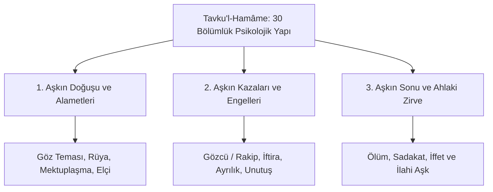

# İbn Hazm ve Tavku'l-Hamâme: Aşk Psikolojisi, Fenomenolojik Tahlil ve Ahlak Felsefesi

> **Yazar:** Ebû Muhammed Alî bin Ahmed bin Saîd bin Hazm el-Endelüsî (994–1064 CE, Kurtuba / Şâtıbe / Manta Lisham)  
> **Temel Eser:** *Tavku'l-Hamâme fi'l-Ülfeti ve'l-Ullâf* (طوق الحمامة في الألفة والألاف / Güvercin Gerdanlığı)  
> **Disiplin:** Aşk Psikolojisi, Fenomenoloji, Ahlak Felsefesi, Zâhirî Epistemoloji, Otobiyografik Edebiyat  
> **Tarihsel Etki:** İnsan ruhunun duygusal hallerini, bakışları, ayrılığı, kıskançlığı ve sadakati klinik ve felsefi bir derinlikle tahlil eden dünya edebiyatının ilk psikolojik aşk monografisi; Avrupa saray aşkı (*Courtly Love / Fin'amor*) edebiyatının öncülü.

---

## 1. Giriş ve Telif Bağlamı

İbn Hazm, Kurtuba Emevî hilafetinin başvezirinin oğlu olarak saray konaklarında, cariyelerin, kâtiplerin ve şairlerin arasında büyümüştür. 1013'te Kurtuba'nın Berberi kabileleri tarafından yağmalanması ve hilafetin çöküşü sırasında ailesi mülksüzleşmiş, kendisi sürgünlere ve zindanlara maruz kalmıştır.

1022 civarında Şâtıbe (Játiva) kalesinde sürgündeyken dostu Ebû Bekr Muhammed'in ricası üzerine *Tavku'l-Hamâme*'yi kaleme almıştır. Eser, salt bir divan şiiri veya hamasi aşk methiyesi değildir; **insan psikolojisini bizzat tecrübe edilmiş vakalar üzerinden inceleyen fenomenolojik bir başyapıttır**.

---

## 2. Epistemolojik ve Psikolojik Yenilikler

### 2.1. Aşkın Tanımı: Ruhların Kozmik Bütünleşmesi
İbn Hazm, aşkı biyolojik bir şehvet veya marazi bir melankoli olarak gören hekimlerin aksine, Platonik ve İslami bir ruh teorisiyle açıklar:
* *“Aşk, parçalanmış ruhların bu âlemde birbirini tanıyıp yeniden birleşme arzusudur. Ruhlar yaratılışlarında yüce bir kürede birdiler; bu dünyaya indiklerinde dağıldılar ve kendi asıllarından olan parçayı ararlar.”*

### 2.2. Beden Dili ve Semiyotik Tahliller
İbn Hazm, aşıkların bakışlarını, göz bebeklerinin büyümesini, ses tonundaki titremeleri ve istem dışı jestleri adeta bir davranış bilimci titizliğiyle sınıflar:
- **Gizli Bakış (*el-İşâretü bi'l-Ayn*):** Kaş kımıldatma, göz kapama, göz ucuyla yön gösterme.
- **Ruhsal Felç:** Sevgilinin aniden belirmesi karşısında aşığın kekelemesi ve renginin atması.

### 2.3. Zâhirî Metodolojinin Edebiyata Tatbiki
İbn Hazm, fıkıhta savunduğu lafızcılık/zâhirîlik prensibini burada da sürdürür: Spekülatif metafizik yerine **bizzat gözlemlediği gerçek insanları**, Kurtuba sarayındaki hanımları ve dostlarının trajedilerini isim vererek veya rumuzlarla analiz eder.

---

## 3. Tematik Bölüm Haritası ve Psikolojik Sınıflama

| Aşama / Bölüm | Psikolojik Tezahür | İbn Hazm'ın Klinik Tespiti |
| :--- | :--- | :--- |
| **Gözle Sevmek (*el-Hubb bi'n-Nazar*)** | İlk bakışta aşk ile uzun süre birlikte yaşamaktan doğan aşkın mukayesesi. | Aniden parlayan aşkın çabuk söndüğünü, yavaş yavaş kök salan muhabbetin ise mezara kadar sürdüğünü belirtir. |
| **Gözcü ve Gammaz (*er-Rakîb ve'l-Vâşî*)** | Sevgililerin arasına giren üçüncü şahısların kıskançlık mekanizması. | İnsan hasedinin, başkalarının mutluluğunu yok etmek için nasıl iftira ürettiğini analiz eder. |
| **Vefasızlık ve Hıyanet (*el-Gadr*)** | Aşk bağının tek taraflı kopuşu ve ruhsal yıkım. | Hıyaneti insanın kendi fıtratına yaptığı en büyük cinayet olarak niteler. |
| **İffet (*el-İffet*)** | Cinsel arzunun ahlaki iradeyle yüceltilmesi (*sublimation*). | Aşkın nihai gayesinin cismani haz değil, ahlaki olgunlaşma ve ruhani tekamül olduğunu savunur. |

---

## 4. Avrupa Edebiyatına ve Saray Aşkı (Courtly Love) Kültürüne Etkisi

1. **Güney Fransa Trubadurları:** William IX of Aquitaine ve Guilhem de Peitieus gibi ilk Oksitan trubadurlarının şiirlerindeki "ulaşılmaz hanıma duyulan saf aşk" (*Amor de Lonh*) ve sevgilinin sırdaşı (*gilos / rakîb*) motifleri doğrudan İbn Hazm'ın şemasından türetilmiştir.
2. **Dante ve Dolce Stil Novo:** Floransalı Dante Alighieri'nin *Vita Nuova* (Yeni Hayat) eserindeki Beatrice figürü ve ruhani aşk felsefesi İbn Hazm'ın iffet anlayışıyla derin paralellikler taşır.
3. **Stendhal'in De l'Amour'u:** 19. yüzyıl Fransız edebiyatçısı Stendhal'in ünlü "kristalizasyon" teorisi, İbn Hazm'ın aşkın doğuşu tahlilleriyle neredeyse birebir örtüşür.

---

## 5. Seçilmiş Birincil Metin Pasajı

> *“Ben aşkı öyle bir sarayda gördüm ki, orada krallar tahtlarından inip aşığın kapısında köle oluyordu. Aşk öyle bir sırdır ki, dilsizleri bülbül yapar, korkaklara kaplan cesareti verir, cimrileri cömert eder, kaba ruhları ipek gibi yumuşatır... Çünkü seven insan, sevdiğinin aynasında kendi kemalini arar.”*  
> — **İbn Hazm**, *Tavku'l-Hamâme Mukaddimesi*

---

## 6. Kaynakça ve Neşirler

- **Pérès, Henri (ed.)**, *Ibn Hazm: Tawq al-Hamama ou Le Collier de la Colombe*, Alger, 1944.
- **Arberry, A. J. (trans.)**, *The Ring of the Dove: A Treatise on the Art and Practice of Arab Love*, London: Luzac & Company, 1953.
- **García Gómez, E.**, *El Collar de la Paloma: Tratado sobre el amor y los amantes de Ibn Hazm de Córdoba*, Madrid: Alianza Editorial, 1952.
- **Boase, Roger**, *The Origin and Meaning of Courtly Love*, Manchester University Press, 1977.
