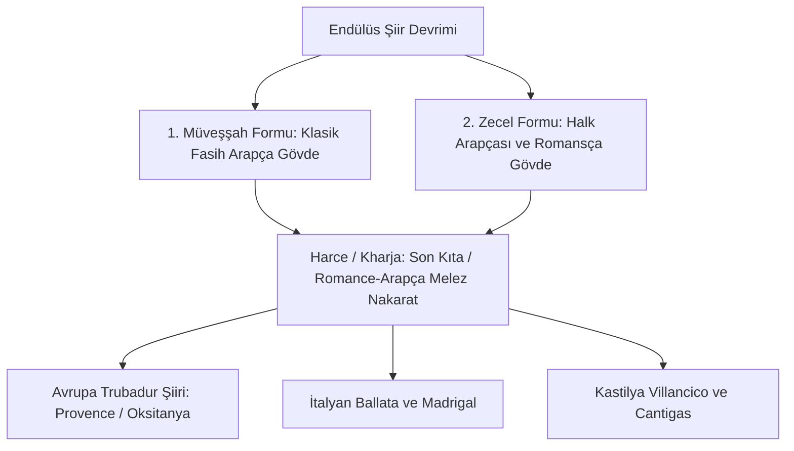

# Müveşşah ve Zecel: Endülüs Melez Şiir Formları, Harce (Kharja) Romans Mısraları ve Avrupa Lirik Şiirinin Doğuşu

> **Yazarlar / Şairler:** Mukaddem bin Muâfâ el-Kabrî (ö. c. 912 CE), İbn Kazmân (Ibn Quzman, ö. 1160 CE, Kurtuba), İbn Zümrük (Alhambra Şairi)  
> **Temel Eser:** *Dîvân-ı İbn Kazmân* (İsâbetü'l-Agrâz fî Zikri'l-A'râz / زجل ابن قزمان)  
> **Disiplin:** Strof Şiir Morfolojisi, Çift Dillilik (Bilingualism), Romans Edebiyatı, Lirik Şiir, Trubadur Mûsikisi  
> **Tarihsel Etki:** Klasik Arap tek-kafiyeli kasidesini yıkarak kıtalar ve nakaratlardan oluşan melez strofik şiiri (müveşşah ve zecel) icat etmiş; şiirin sonundaki İspanyolca/Romansça mısralarla (harce / kharja) İber Yarımadası'nın ve Avrupa'nın en eski lirik şiir anıtını oluşturmuştur.

---

## 1. Giriş ve Şiirsel Devrimin Doğuşu

Klasik Arap şiiri, yüzyıllar boyunca çöl aristokrasisinin tek bir vezin ve tek bir kafiye (*kâfiye-i muvahhade*) üzerinde yüzlerce beyit boyunca aktığı katı **kaside** kalıbına bağlıydı. Ancak 9. yüzyılın sonunda çok dilli, çok kültürlü ve neşeli Endülüs şehirlerinde (Kurtuba, Cabra, Sevilla) bu katı yapı çöktü.

Cabra (Kabre) doğumlu âmâ şair **Mukaddem bin Muâfâ el-Kabrî** (ö. c. 912), klasik kasideyi parçalayarak mısraları değişen, her bendi bağımsız kafiyelenen ve ortak bir nakaratla bağlanan **Müveşşah** (*el-Muvaşşah / kemerli, işlemeli gerdanlık*) formunu icat etti. 12. yüzyılda ise Kurtubalı şair **İbn Kazmân**, klasik Arapçayı tamamen bir kenara bırakıp halkın konuştuğu Endülüs Arapçası ve Romansça karışımıyla **Zecel** (*Zajal*) türünü zirveye taşıdı.

---

## 2. Müveşşah ve Zecel Metrik Morfolojisi

### 2.1. Müveşşahın Anatomisi
Bir müveşşah 5 ila 7 kıtadan (*beyt / sımât*) meydana gelir. Yapısı şöyledir:
1. **Matla' / Mezhâb:** Şiirin başındaki iki mısralık giriş nakaratı (aa).
2. **Gusn / Ebyât:** Her bendin içinde kendi arasında kafiyelenen 3 mısra (bbb).
3. **Kufl / Sımât:** Matla'ın kafiyesine dönen ara nakarat (aa).
4. **Harce (*Kharja*):** Şiirin en can alıcı zirvesi; son bendin son iki mısrası. Burası mutlaka **genç bir kadının ağzından**, aşırı samimi, feryat dolu ve **Endülüs Romansçası (*Mozarabic Romance*)** ile söylenir.

### 2.2. Zecel: Sokakların ve Meydanların Şiiri
İbn Kazmân'ın geliştirdiği zecel, i'rab kurallarını (Arapça gramer son eklerini) tamamen yok sayar. Kurtuba çarşılarındaki fırıncıları, şarap meclislerini, kabadayıları, sokak kavgalarını ve genç sevgilileri canlı bir halk diliyle hicveder.

---

## 3. Harce (Kharja) Örnekleri ve Dilbilimsel Çözümleme

Aşağıdaki metin, Samuel Miklos Stern ve Emilio García Gómez tarafından 1948'de deşifre edilen ve İspanyol edebiyatının bilinen **en eski lirik şiiri** kabul edilen bir harcedir:

| Orijinal Arap Alfabesiyle Yazılmış Romansça Metin | İspanyolca Rekonstrüksiyon | Türkçe Çevirisi |
| :--- | :--- | :--- |
| **يا فليو حبيب / بياش بياش كم تيب** | *¡Tant' amáre, tant' amáre, / habib, tant' amáre! / Enfermaron weliolyos gayos, / ¡ya dūlen tan mále!* | *Ah o kadar sevdim, o kadar çok sevdim ki sevgilim! / Işıl ışıl parlayan gözlerim hastalandı aşktan, / Şimdi nasıl da yanıp sızlıyorlar!* |

---

## 4. Avrupa Lirik Şiirine ve Trubadur Edebiyatına Etkisi

1. **Guillaume IX of Aquitaine (1071–1126):** İlk Fransız trubadurunun şiirlerindeki kafiye şeması ($aaabab$), İbn Kazmân'ın zecelleriyle matematiksel olarak aynıdır.
2. **Kral X. Alfonso'nun Cantigas de Santa Maria'sı:** 13. yüzyılda bestelenen 400'den fazla Galisyo-Portekizce Meryem Ana ilahisinin müzikal ve metrik formu doğrudan zecel yapısıdır.
3. **İtalyan Şiirinde Strof:** Dante ve Petrarca'nın kullandığı *ballata* ve soneler, Endülüs müveşşahlarının Akdeniz limanları üzerinden İtalya'ya intikal eden varyasyonlarıdır.

---

## 5. Elhamra Sarayı Duvarlarındaki Şiirler (İbn Zümrük)

Müveşşah formu, Gırnata Nasrî emirliğinde saray mimarisiyle bütünleşmiştir. **İbn Zümrük'ün** şiirleri, Elhamra'nın Aslanlı Avlusu'ndaki fıskiyelerin çanağına ve taht salonunun mukarnaslı kemerlerine oyulmuştur:

> *“Ben suyun kristalleşip mücevhere dönüştüğü bir tacım; / Aslanların ağzından dökülen sular, emirin cömertliği gibi fışkırır durur.”*

---

## 6. Kaynakça

- **Stern, Samuel Miklos**, *Les Chansons mozarabes: Les vers finaux (kharjas) des muwashshahs arabes et hébreux*, Palermo, 1953.
- **García Gómez, Emilio**, *Las Jarchas romances de la serie árabe en su marco*, Madrid, 1965.
- **Corriente, Federico**, *Gramática, métrica y texto del Cancionero hispanoárabe de Abán Quzmán*, Madrid: Instituto Hispano-Árabe de Cultura, 1980.
- **Monroe, James T.**, *Hispano-Arabic Poetry: A Student Anthology*, University of California Press, 1974.
- **Menocal, María Rosa**, *The Arabic Role in Medieval Literary History: A Forgotten Heritage*, University of Pennsylvania Press, 1987.
