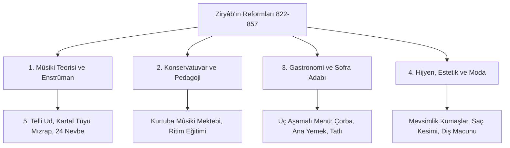

# Ziryâb (Ali bin Nâfi') ve Endülüs Mûsikisi: Nevbe Makam Sistemi, Beş Telli Ud ve Kültür Reformları

> **Yazar / Şahsiyet:** Ebû'l-Hasen Alî bin Nâfi' (Ziryâb / زرياب, 789–857 CE, Bağdat / Kurtuba)  
> **Temel Alan:** Modal Mûsiki Teorisi, Endülüs Nevbe (*Nawba*) Geleneği, Konservatuvar Pedagojisi, Gastronomi ve Saray Protokolü  
> **Tarihsel Etki:** İshak el-Mevsılî'nin talebesi olarak Bağdat'tan Kurtuba'ya gelmiş; ud çalgısına 5. teli eklemiş, Avrupa flamenko ve trubadur mûsikisinin köklerini oluşturan 24 nevbe makam sistemini ve modern sofra adabını kurmuştur.

---

## 1. Tarihsel Arka Plan ve Ziryâb'ın Kurtuba'ya Gelişi

Ali bin Nâfi', Abbâsî halifesi Hârûnürreşîd devrinde Bağdat sarayının başmüzisyeni İshak el-Mevsılî'nin en yetenekli talebesiydi. Sesinin tizliği ve siyahî teni sebebiyle "karatavuk" anlamına gelen **Ziryâb** lakabıyla anılmıştır. Hocasının kıskançlığı üzerine Bağdat'tan ayrılmış, Kuzey Afrika üzerinden 822 yılında Endülüs Emevî Emiri **II. Abdurrahman'ın** davetiyle Kurtuba'ya ulaşmıştır.

II. Abdurrahman, Ziryâb'ı Kurtuba kapılarında bizzat karşılamış; kendisine aylık 200 dinar maaş, saraylar ve araziler tahsis etmiştir. Ziryâb, Kurtuba'da sadece bir müzisyen değil, bir **kültür ve yaşam tarzı mimarı** olarak 30 yıl boyunca İberya toplumunu dönüştürmüştür.

---

## 2. Mûsiki Kuramı ve Enstrümantal Devrimler

### 2.1. Udda Beşinci Tel ve Kartal Teleği (Mızrap)
Ziryâb'a kadar klasik Doğu udu dört telliydi ve insan bedenindeki dört hıltı (*kan, balgam, safra, sevda*) temsil ediyordu. Ziryâb:
1. U گرdün ortasına kırmızı renkle boyanmış **beşinci teli** (*el-vatarü'l-hâmis*) eklemiştir. Bu tel **insan ruhunu / nefsi** temsil ediyordu.
2. Tahtadan veya kemikten yapılan sert mızraplar yerine, sesin tınısını yumuşatan ve teli yıpratmayan **akbaba / kartal kanadı teleğini** mızrap olarak kullanmıştır.
3. Udun gövdesini hafifletmiş, ipek yerine işlenmiş bağırsak teller kullanarak akustik rezonansı artırmıştır.

### 2.2. Endülüs Nevbe (*Nawba*) Makam Sistemi
Günün 24 saatine ve insan ruhunun 24 farklı duygu haline tekabül eden **24 Nevbe** süit formunu geliştirmiştir. Her nevbe; yavaş bir enstrümantal girişten (*İstiftâh/Mişliyâ*), tempolu vokal bölümlere ve hızlı kapanışa (*İnsırâf*) uzanan dört ana bölümden oluşuyordu. Bu yapı, Klasik Batı müziğindeki **senfoni ve sonat** formunun en erken prototipidir.

### 2.3. Avrupa'nın İlk Konservatuvarı
Kurtuba'da kurduğu müzik okulunda sistemli bir şan eğitimi müfredatı uygulamıştır:
- **Aşama 1:** Talebenin ritim kulağını ölçmek için def üzerinde tartım yaptırılması.
- **Aşama 2:** Basit hecelerle (*â, yâ*) göğüs ve diyafram sesinin açılması.
- **Aşama 3:** Şiir ve güfte ezberlenerek makam geçişlerinin icrası.

---

## 3. Kültür, Gastronomi ve Gündelik Yaşam Reformları

| Alan | Ziryâb Öncesi İberya | Ziryâb'ın Getirdiği Yenilik |
| :--- | :--- | :--- |
| **Yemek Servisi** | Tüm yemeklerin aynı anda masaya konması. | **Üç aşamalı servis:** Önce çorba, ardından et/balık yemekleri, en son tatlı ve kuruyemiş (modern restorancılığın temeli). |
| **Masa Eşyası** | Altın ve gümüş kadehler, ahşap kaplar. | Şarabın ve suyun tadını bozmayan **kristal ve cam kadehler**; keten sofra örtüleri. |
| **Sebze ve Bitkiler** | Sınırlı Akdeniz mutfağı. | **Kuşkonmazın (*isparâğ*)**, enginarın ve bamyanın mutfağa sokulması; bademli tatlılar. |
| **Giyim ve Moda** | Yıl boyu aynı tip yünlü elbiseler. | **Mevsimlik gardırop:** İlkbaharda ipek ve açık renkler, yazın saf beyaz keten, kışın kürk ve kadife astarlı koyu kumaşlar. |
| **Hijyen ve Kozmetik** | Ağır yağlar ve kaba temizlik. | Koltuk altı deodorantı, aromatik diş macunları, saçların önden kâkül bırakılarak modern kesimi. |

---

## 4. Avrupa Mûsikisine ve Flamenkoya Mirası

1. **Trubadur Geleneği:** Güney Fransa ve İtalya'da 11. yüzyılda doğan şövalye şairlerin (*troubadours*) aşk şarkıları, Ziryâb'ın nevbeleri ve Endülüs zecelleriyle aynı modal ve vezinsel yapıya sahiptir.
2. **Flamenko Müziğinin Doğuşu:** Endülüs nevbeleri, İspanyol çingenelerinin (*Gitanos*) melodileri ve yerel halk ezgileriyle meczolarak bugünkü Flamenko sanatının (*Cante Jondo*) temelini oluşturmuştur.
3. **Gitarın Evrimi:** Ziryâb'ın beş telli udu, İspanya'da *vihuela* ve nihayetinde 6 telli modern klasik gitara evrilmiştir.

---

## 5. Seçilmiş Birincil Metin Pasajı

> *“Ziryâb Kurtuba'ya girdiğinde mûsikide öyle bir ihtişam kapısı açtı ki, daha önce ne Doğu'da ne de Batı'da böylesi işitilmişti. O, sadece tellere dokunan bir sazende değildi; krallara zarafeti, halka temizliği, sofraya adabı ve ruhlara ahengi öğreten bir medeniyet üstadıydı.”*  
> — **İbn Hayyân el-Kurtubî**, *el-Muktebes fî Târîhi Ricâli'l-Endelüs*

---

## 6. Kaynakça

- **İbn Abd Rabbihi**, *el-ʿİkdü'l-Ferîd*, Cilt 6 (Mûsiki Faslı), Kahire, 1953.
- **El-Makkarî**, *Nefhu't-Tîb min Gusni'l-Endelüsi'r-Ratîb*, Cilt 3 (Ziryâb Tercümesi), Beyrut, 1968.
- **Farmer, Henry George**, *A History of Arabian Music to the XIIIth Century*, London: Luzac & Co., 1929.
- **Guettat, Mahmoud**, *La Musique classique du Maghreb*, Paris: Sindbad, 1980.
- **Reynolds, Dwight**, *Music and the Global Middle Ages: The Arab-Andalusian Musical Tradition*, Cambridge University Press, 2021.
