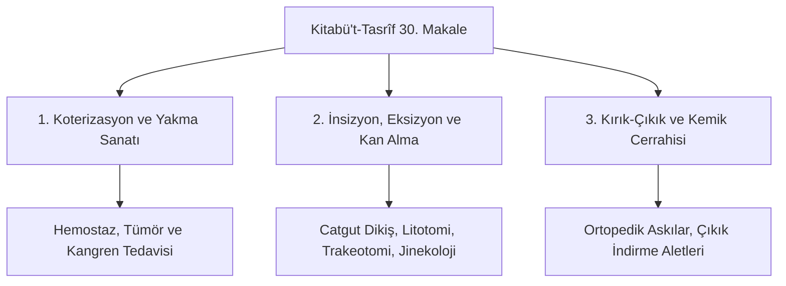

# Ebû'l-Kâsım ez-Zehrâvî (Abulcasis) ve Kitâbü't-Tasrîf 30. Makale: Cerrahi Enstrüman Morfolojisi ve Ameliyat Metodolojisi

> **Yazar:** Ebû'l-Kâsım Halef bin Abbâs ez-Zehrâvî (936–1013 CE, Medînetü'z-Zehrâ / Kurtuba)  
> **Temel Eser:** *Kitâbü't-Tasrîf li-men ʿaceze ʿani't-te'lîf* (كتاب التصريف لمن عجز عن التأليف), 30. Makale (*el-ʿAmel bi'l-Yed*)  
> **Disiplin:** Operatif Cerrahi, Enstrüman Tasarımı, Jinekoloji, Ortopedi, Diş Hekimliği, Farmasötik Cerrahi  
> **Tarihsel Etki:** Gerard of Cremona tarafından 12. yüzyılda Toledo'da *Chirurgia Albucasis* başlığıyla Latinceye çevrilmiş; Montpellier, Bologna, Padova ve Paris Tıp Fakültelerinde 450 yıl boyunca temel başvuru kaynağı olmuştur.

---

## 1. Giriş ve Tarihsel Bağlam

Ebû'l-Kâsım ez-Zehrâvî, III. Abdurrahman ve II. Hakem devirlerinde Endülüs Emevî hilafetinin başkenti Kurtuba yakınlarındaki Medînetü'z-Zehrâ saray şehrinde hekimlik ve başcerrahlık yapmıştır. 30 ciltten oluşan ansiklopedik eseri *Kitâbü't-Tasrîf*, tıp teorisinden farmakolojiye, diyetetikten cerrahiye kadar tıbbın tüm şubelerini ihtiva eder. 

Eserin en mühim ve devrimci kısmı **30. Makale**'dir. Zehrâvî, cerrahiyi hekimlerin küçümsediği veya berber-cerrahlara terk ettiği bir dönemde; cerrahiyi katı bir **anatomi bilgisi**, **titiz hijyen/hemostaz protokolleri** ve **özelleşmiş çelik alet tasarımı** temeline oturtarak müstakil bir tıp bilimi haline getirmiştir.

---

## 2. Temel Cerrahi İcatlar ve Metodolojik Yenilikler

### 2.1. İç Dikişlerde Kedi Bağırsağı (Catgut) Kullanımı
Zehrâvî, karın ve bağırsak yaralanmalarında dikiş materyali olarak hayvan bağırsağını (*evtar*) kullanan ilk cerrahtır. Kedi bağırsağından elde edilen ince liflerin vücut dokuları tarafından zamanla emildiğini (biyobozunurluk) gözlemlemiş, böylece modern rezorbe olabilen dikiş ipliklerinin temelini atmıştır.

### 2.2. Taş Kırma ve Çıkarma Enstrümanı (el-Miş'ab / Lithotrite)
Mesane taşlarının cerrahi olarak çıkarılması (litotomi) için özel *el-mişʿab* aletini geliştirmiştir. Taşın idrar torbasında tutularak dar bir kanaldan delinmesini, parçalanmasını ve dışarı alınmasını sağlayarak çevre doku travmasını asgariye indirmiştir.

### 2.3. Vajinal Spekulum ve Doğum Pozisyonları
Kadın hastalıkları ve zor doğumlarda ceninin güvenle çıkarılması için çift vidalı vajinal spekulumlar (*miṣʿad*) ve özel kancalar (*kullāb*) tasarlamıştır. Günümüzde "Walcher pozisyonu" olarak bilinen doğum manevrasını Walcher'den 900 yıl önce eksiksiz tarif etmiştir.

### 2.4. Koterizasyon (Dağlama) ve Hemostaz
Kanamanın durdurulması ve açık yaraların enfeksiyondan korunması için farklı formlarda (zeytin çekirdeği uçlu, bıçak ağızlı, hilal biçimli) 50'den fazla demir ve bakır koter aleti geliştirmiştir.

---

## 3. Enstrüman Tipolojisi ve Tasarım İlkeleri

*Kitâbü't-Tasrîf*, tıp tarihinde **aletlerin teknik resim ve ölçüleriyle birlikte basıldığı ilk cerrahi kitaptır**. 200'den fazla enstrümanın detaylı çizimleri yer alır:

| Enstrüman Adı | Arapça Adı | Kullanım Alanı ve Morfolojik Özellik |
| :--- | :--- | :--- |
| **Mişret** | مشرط | İnce neşter; apselerin açılması ve hassas göz ameliyatları |
| **Mişʿab** | مشعب | Mesane taşlarını delip parçalayan matkap uçlu mekanik kavrayıcı |
| **Mikhzā** | مخذاع | Amputasyonlarda kemiği ezmeden kesen çift kollu cerrahi testere |
| **Kullāb** | كلاب | Doku ve damarları tutmak için tırtıklı cerrahi forseps / kerpeten |
| **Cessâs** | جساس | Yaraların derinliğini ve yabancı cisimleri tespit eden gümüş sondalar |
| **Mir'ât el-Rahim**| مرآة الرحم | Açılıp kapanabilen mekanik vidalı pelvik spekulum |

---

## 4. Latinceye İntikal ve Skolastik Avrupa Cerrahisine Etkisi

Toledo Tercüme Mektebi'nde Cremonalı Gerard tarafından tercüme edilen metin, Batı dünyasında cerrahi tahsilinin omurgasını teşkil etmiştir:

> *"Zehrâvî olmasaydı cerrahlarımız kör, teşhislerimiz eksik kalırdı. Biz neşter kullanmayı ve kemik bağlamayı Kurtuba hekimlerinden öğrendik."*  
> — **Guy de Chauliac** (*Chirurgia Magna*, 1363)

İtalyan cerrahlar Lanfranc of Milan ve William of Saliceto, Zehrâvî'nin metinlerini doğrudan iktibas etmiş; eserin Oxford (Bodleian Huntington 156), Paris (BNF Arabe 2136) ve El Escorial (MS Árabe 887) nüshaları yüzyıllar boyu hekimlerin başucu rehberi olmuştur.

---

## 5. Birincil Kaynakça ve Yazma Nüshalar

1. **El Escorial Manastır Kütüphanesi:** *MS Árabe 887* (13. yy sonu, tam cerrahi bölümü ve enstrüman minyatürleri).
2. **Bibliothèque nationale de France (BnF):** *MS Arabe 2136* & *MS Latin 6882* (*Chirurgia Albucasis*).
3. **Bodleian Library, Oxford:** *MS Huntington 156* (John Channing'in 1778 tarihli Oxford neşrinin temel yazması).
4. Spink, M. S., & Lewis, G. L. (1973). *Albucasis on Surgery and Instruments: A Definitive Edition and English Translation*. London: Wellcome Institute of the History of Medicine.
