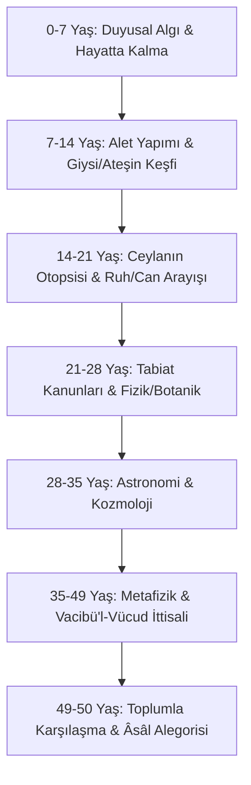

# İbn Tufeyl (Abubacer) ve Hayy bin Yakzân: Tabula Rasa, Tecrübi Akıl ve Tabiat Felsefesi

> **Yazar:** Ebû Bekr Muhammed bin Abdilmelik bin Tufeyl el-Kaysî (1105–1185 CE, Guadix / Merakeş)  
> **Temel Eser:** *Risâletü Hayy bin Yakzân* (رسالة حي بن يقظان في أسرار الحكمة المشرقية)  
> **Disiplin:** Felsefi Roman, Ampirist Epistemoloji, Tabula Rasa, Otodidaktik Akıl  
> **Tarihsel Etki:** 1671'de Edward Pococke tarafından *Philosophus Autodidactus* adıyla Latinceye çevrilmiş; John Locke, Baruch Spinoza ve Daniel Defoe'yu (*Robinson Crusoe*) doğrudan etkilemiştir.

---

## 1. Giriş ve Alegorik Felsefe

Muvahhid saray başhekimi ve veziri olan İbn Tufeyl, insan aklının hiçbir vahiy veya toplumsal eğitim olmadan, sadece gözlem, deney, anatomi ve tabiat tefekkürüyle Tanrı'nın varlığına ve metafizik hakikatlere ulaşabileceğini ispatlamak üzere *Hayy bin Yakzân* romanını yazmıştır.

---

## 2. Hayy'ın 7 Yıllık Epistemolojik Evreleri

1. **Biyolojik ve Ampirik Evre:** Kendisini büyüten anne ceylanın ölümü üzerine Hayy, onun bedenini disseksiyon (otopsi) yaparak inceler; kalbin sol odacığındaki boşluğu görerek hayatın maddi bedenden öte bir ilkeye bağlı olduğunu keşfeder.
2. **Kozmolojik ve Mantıksal Evre:** Gök cisimlerinin dairesel hareketlerini, yıldızları ve tabiatın intizamını gözlemleyerek evrenin bir muharrike ve yaradana muhtaç olduğunu çıkarır.
3. **Mistik ve Akli İttisal:** Varlığın birliğini idrak eder.
4. **Toplumsal Sınav (Absâl ve Selâmân):** Komşu adadan gelen dindar Absâl ile karşılaşır; Absâl'ın nakli dini ile Hayy'ın saf akli keşfinin birebir aynı hakikati anlattığını görürler. Ancak topluma bunu anlattıklarında kitlelerin dogmalara ve şekilciliğe bağlı olduğunu görerek adaya geri dönerler.

---

## 3. Aydınlanma Felsefesine ve Modern Edebiyata Etkisi

1671'de Oxford'da basılan Latince çeviri, John Locke'un *İnsan Anlığı Üzerine Bir Deneme* eserindeki "boş levha" (*tabula rasa*) kavramının ilham kaynağı olmuştur.

---

## 4. Kaynakça

1. **Bodleian Library:** *MS Pococke 263*.
2. Pococke, Edward. (1671). *Philosophus Autodidactus*. Oxford: Excudebat H. Hall.
3. Gauthier, Léon. (1909). *Ibn Thofaïl, sa vie, ses œuvres*. Paris: Leroux.
